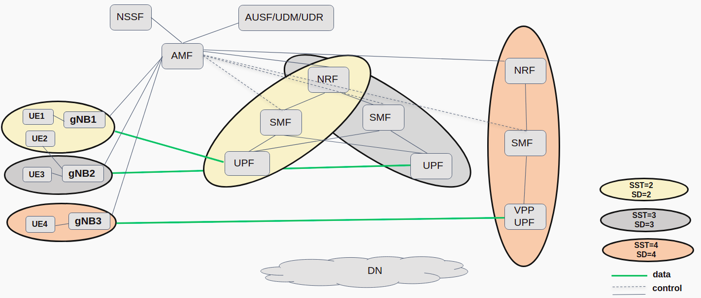
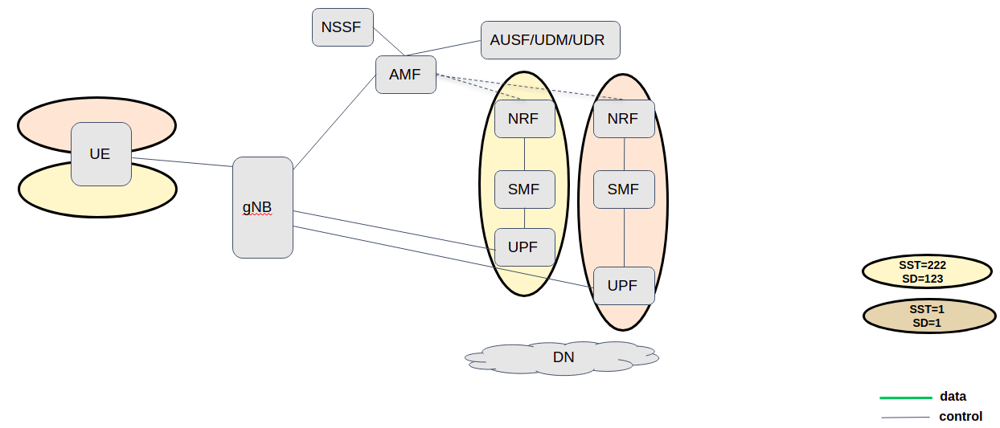

<table style="border-collapse: collapse; border: none;">
  <tr style="border-collapse: collapse; border: none;">
    <td style="border-collapse: collapse; border: none;">
      <a href="http://www.openairinterface.org/">
         
         </img>
      </a>
    </td>
    <td style="border-collapse: collapse; border: none; vertical-align: center;">
      <b><font size = "5">OpenAirInterface 5G Core Network Deployment and Testing with gnbsim</font></b>
    </td>
  </tr>
</table>



**Reading time: ~ 30mins**

**Tutorial replication time: ~ 1h30mins**

Note: In case readers are interested in deploying debuggers/developers core network environment with more logs please follow [this tutorial](./DEBUG_5G_CORE.md)

**TABLE OF CONTENTS**

1.  Pre-requisites
2.  Building Container Images
3.  Configuring Host Machines
4.  Configuring OAI 5G Core Network Functions
5.  [Deploying OAI 5G Core Network](#5-deploying-oai-5g-core-network)
6.  [Getting a `ransim` docker images](#6-getting-a-gnbsim-docker-images)
7.  [Executing `ransim` Scenario](#7-executing-the-gnbsim-scenario)
8.  [Traffic test](#8-traffic-test)
9.  [Analysing Scenario Results](#9-analysing-the-scenario-results)
10. [UE with multiple S-NSSAIs](#10-ue-with-multiple-s-nssais)
11. [Undeploy network](#11-analysing-the-scenario-results)

* In this demo the image tags and commits which were used are listed below, follow the [Building images](./BUILD_IMAGES.md) to build images with below tags. 

You can also retrieve the images from `docker-hub`. See [Retrieving images](./RETRIEVE_OFFICIAL_IMAGES.md).

| CNF Name    | Branch Name    | Tag used at time of writing   | Ubuntu 18.04 | RHEL8          |
| ----------- |:-------------- | ----------------------------- | ------------ | ---------------|
| NSSF        | `develop`      | `v1.2.1`                      | X            | X              |
| AMF         | `develop`      | `v1.2.1`                      | X            | X              |
| AUSF        | `develop`      | `v1.2.1`                      | X            | X              |
| NRF         | `develop`      | `v1.2.1`                      | X            | X              |
| SMF         | `develop`      | `v1.2.1`                      | X            | X              |
| UDR         | `develop`      | `v1.2.1`                      | X            | X              |
| UDM         | `develop`      | `v1.2.1`                      | X            | X              |
| SPGWU       | `develop`      | `v1.2.1`                      | X            | X              |
| UPF-VPP     | `develop`      | `v1.2.1`                      | X            | X              |

<br/>

In this tutorial we are going to explore slicing feature of OAI 5G core network. Here we will validate -
* UPF selection based on S-NSSAI
* SMF selection based on S-NSSAI
* NRF selection based on S-NSSAI (With help of NSSF)
* AMF selection based on S-NSSAI (With help of NSSF - Next Release, March 2022)
* Single UE with multiple S-NSSAIs (With the help of commercial tool dsTest)

A Network Slice is defined within a PLMN and it incorporates the 5G Core and 5G RAN components. Network slice is identified as Single Network Slice Selection Assistance Information (S-NSSAI). A S-NSSAI is consist of Slice/Service type (SST) and Slice Differentiator (SD). SST is mandatory filed which defines expected slice behavior in terms of features and services. Whereas SD is optional field which can be used to differentiate amongst multiple slices. Currently 3GPP allows up to eight (8) S-NSSAIs in the NSSAI sent in signaling messages between the UE and the Network, means a single UE may be served by at most eight Network Slices at a time. SST length is 8 bits so it can provides 2^8= 256 SST values from which there are reserved values O to 127 for standardized SSTs (e.g. SST 2 = URLCC, SST 3 = MIoT, SST 4 = V2X etc.). 

###### Slicing current status in OAI 5G CN -
* Role of NSSF -> NSSF currently supports, slice slection during pdu session establishment request. When AMF is not locally configured with NRF information, then with the help of NSSF it discovers appropriate NRF based on S-NSSAI provided.
* Role of AMF  -> AMF slectes first available SMF from the NF instance list (of SMF) provided by appropriate NRF.
* Role od SMF  -> SMF can associates with multiple UPFs at same time as in slice 2 and 3 from above figure. UPF is selected here based on S-NSSAI and DNN.

As shown in figure above, there are 3 S-NSSAIs configured (Can be differentiated with colors) viz. <br/>
Note:- Here we have used standardised SST values (2,3,4), because rf-simulator only supports SST values 1,2,3,4. Moreover, it only for numerical refernece and does not reflect standrd SST behaviour e.g. URLCC, MIoT, V2X etc.<br/>
###### Slice1: [SST=2,SD=2] =>   NRF1, SMF1, UPF1, GNB1, UE1
###### Slice2: [SST=3,SD=3] =>   NRF1, SMF2, UPF2, GNB2, UE2
###### Slice3: [SST=4,SD=4] =>   NRF2, SMF3, VPP-UPF3, GNB3, UE3

Here AMF, NSSF, UDM, UDR, AUSF are common to all slices. SMF and UPF in S-NSSAI 2 and 3 have same NRF hence both UPFs are discoverable to both SMF. You can verify in the logs that both SMFs are successfullt associated to both UPFs in S-NSSAI 2 and 3. Here number of SMFs/UPFs for registered under single (NSI) NRF is part of operator's network planning.<br/>


###### Let's begin !!

* Steps 1 to 4 are similar as previous tutorials such as [minimalist](./DEPLOY_SA5G_MINI_DS_TESTER_DEPLOYMENT.md) or [basic](./DEPLOY_SA5G_BASIC_DS_TESTER_DEPLOYMENT.md) deployments. Please follow these steps to deploy OAI 5G core network components.

## 5. Deploying OAI 5g Core Network ##

* We deploy `basic` version 5g core with additional component oai-nssf. We will use `docker-compose` to deploy 5g core as below -
```bash
oai-cn5g-fed/docker-compose$ docker-compose -f docker-compose-slicing-basic-nrf.yaml up -d
Creating network "demo-oai-public-net" with driver "bridge"
Creating network "oai-public-access" with the default driver
Creating network "oai-public-core" with the default driver
Creating oai-nrf-slice12 ... done
Creating oai-nssf         ... done
Creating oai-ext-dn       ... done
Creating mysql            ... done
Creating oai-nrf-slice3   ... done
Creating oai-spgwu-slice2 ... done
Creating oai-udr          ... done
Creating vpp-upf-slice3   ... done
Creating oai-udm          ... done
Creating oai-ausf         ... done
Creating oai-amf          ... done
Creating oai-smf-slice3   ... done
Creating oai-smf-slice1   ... done
Creating oai-smf-slice2   ... done
Creating oai-spgwu-slice1 ... done
```

* Make sure all services are healthy -

```bash
oai-cn5g-fed/docker-compose$ docker ps -a
CONTAINER ID   IMAGE                    COMMAND                  CREATED          STATUS                    PORTS                          NAMES
4b75e9b715d3   oai-spgwu-tiny:develop   "/openair-spgwu-tiny…"   46 seconds ago   Up 45 seconds (healthy)   2152/udp, 8805/udp             oai-spgwu-slice1
5e52b529455f   oai-smf:develop          "/bin/bash /openair-…"   47 seconds ago   Up 46 seconds (healthy)   80/tcp, 9090/tcp, 8805/udp     oai-smf-slice2
1da7df33427a   oai-smf:develop          "/bin/bash /openair-…"   47 seconds ago   Up 46 seconds (healthy)   80/tcp, 9090/tcp, 8805/udp     oai-smf-slice1
b8c7a13ba869   oai-smf:develop          "/bin/bash /openair-…"   47 seconds ago   Up 46 seconds (healthy)   80/tcp, 9090/tcp, 8805/udp     oai-smf-slice3
fb4ba1055b04   oai-amf:develop          "/bin/bash /openair-…"   47 seconds ago   Up 47 seconds (healthy)   80/tcp, 9090/tcp, 38412/sctp   oai-amf
63e1e7302835   oai-ausf:develop         "/bin/bash /openair-…"   48 seconds ago   Up 47 seconds (healthy)   80/tcp                         oai-ausf
c560aaa93b91   oai-udm:develop          "/bin/bash /openair-…"   49 seconds ago   Up 48 seconds (healthy)   80/tcp                         oai-udm
f3c4ecfac1db   oai-upf-vpp:develop      "/openair-upf/bin/en…"   50 seconds ago   Up 48 seconds (healthy)   2152/udp, 8085/udp             vpp-upf-slice3
80aa4e12169a   oai-udr:develop          "/bin/bash /openair-…"   50 seconds ago   Up 48 seconds (healthy)   80/tcp                         oai-udr
c509b4711de3   oai-spgwu-tiny:develop   "/openair-spgwu-tiny…"   50 seconds ago   Up 49 seconds (healthy)   2152/udp, 8805/udp             oai-spgwu-slice2
c1bd7b8afb8c   mysql:5.7                "docker-entrypoint.s…"   51 seconds ago   Up 49 seconds (healthy)   3306/tcp, 33060/tcp            mysql
e014638c3e12   oai-nrf:develop          "/bin/bash /openair-…"   51 seconds ago   Up 49 seconds (healthy)   80/tcp, 9090/tcp               oai-nrf-slice3
bf6544a04f1f   oai-nssf:develop         "/bin/bash /openair-…"   51 seconds ago   Up 49 seconds (healthy)   80/tcp, 8080/tcp               oai-nssf
33a43a237af6   ubuntu:bionic            "/bin/bash -c ' apt …"   51 seconds ago   Up 49 seconds (healthy)                                 oai-ext-dn
0459b8ca6490   oai-nrf:develop          "/bin/bash /openair-…"   51 seconds ago   Up 50 seconds (healthy)   80/tcp, 9090/tcp               oai-nrf-slice12
```

## 6. Getting a `ransim` docker images ##

We are using 3 different ran simulators viz. [ueransim](https://github.com/aligungr/UERANSIM), [rfsimulator](https://gitlab.eurecom.fr/oai/openairinterface5g/-/tree/develop/ci-scripts/yaml_files/5g_rfsimulator) and [gnbsim](https://gitlab.eurecom.fr/kharade/gnbsim) for slice 2, 3 and 4 repectively. Each of them has there set of features, and one can use as per need basis. Different ransimulator usage mimics here, the realistic deployemnt scenario where operator can have multi vendor devices deployed  in the network. <br/>

You can pull docker images from official repositories as below -

```bash
$ docker pull rohankharade/gnbsim:latest
$ docker pull rohankharade/ueransim:latest
$ docker pull rdefosseoai/oai-gnb:develop
$ docker pull rdefosseoai/oai-nr-ue:develop
```
And re-tag them for tutorials' docker-compose file to work.
```bash
$ docker image tag rohankharade/gnbsim:latest gnbsim:latest
$ docker image tag rohankharade/ueransim:latest ueransim:latest
$ docker image tag rdefosseoai/oai-gnb:develop oai-gnb:develop
$ docker image tag rdefosseoai/oai-nr-ue:develop oai-nr-ue:develop
```

## 7. Executing `ransim` Scenario ##

We deploy ran simulators with the help of docker-compose as below -

```bash
oai-cn5g-fed/docker-compose$ docker-compose -f docker-compose-slicing-ransim.yaml up -d
Creating gnbsim             ... done
Creating ueransim           ... done
Creating rfsim5g-oai-gnb    ... done
Creating rfsim5g-oai-nr-ue1 ... done
```
Wait a bit 
```bash
oai-cn5g-fed/docker-compose$ docker-compose -f docker-compose-slicing-ransim.yaml ps -a
       Name                     Command                  State       Ports
--------------------------------------------------------------------------
gnbsim               /gnbsim/bin/entrypoint.sh  ...   Up (healthy)        
rfsim5g-oai-gnb      /opt/oai-gnb/bin/entrypoin ...   Up (healthy)        
rfsim5g-oai-nr-ue1   /opt/oai-nr-ue/bin/entrypo ...   Up (healthy)        
ueransim             /ueransim/bin/entrypoint.sh      Up (healthy)  
```

After successful deployment we can verify at AMF that all gnbs and ues are successfully registered to network.
```bash
[2021-12-13T20:47:20.265472] [AMF] [amf_app] [info ] |----------------------------------------------------------------------------------------------------------------|
[2021-12-13T20:47:20.265497] [AMF] [amf_app] [info ] |----------------------------------------------------gNBs' information-------------------------------------------|
[2021-12-13T20:47:20.265503] [AMF] [amf_app] [info ] |    Index    |      Status      |       Global ID       |       gNB Name       |               PLMN             |
[2021-12-13T20:47:20.265522] [AMF] [amf_app] [info ] |      1      |    Connected     |         0x1           |UERANSIM-gnb-208-95-1 |            208, 95             | 
[2021-12-13T20:47:20.265530] [AMF] [amf_app] [info ] |      2      |    Connected     |         0x1400        |                      |            208, 95             | 
[2021-12-13T20:47:20.265537] [AMF] [amf_app] [info ] |      3      |    Connected     |         0xe000        |         gnb-rfsim    |            208, 95             | 
[2021-12-13T20:47:20.265543] [AMF] [amf_app] [info ] |----------------------------------------------------------------------------------------------------------------|
[2021-12-13T20:47:20.265548] [AMF] [amf_app] [info ] 
[2021-12-13T20:47:20.265553] [AMF] [amf_app] [info ] |----------------------------------------------------------------------------------------------------------------|
[2021-12-13T20:47:20.265558] [AMF] [amf_app] [info ] |----------------------------------------------------UEs' information--------------------------------------------|
[2021-12-13T20:47:20.265564] [AMF] [amf_app] [info ] | Index |      5GMM state      |      IMSI        |     GUTI      | RAN UE NGAP ID | AMF UE ID |  PLMN   |Cell ID|
[2021-12-13T20:47:20.265951] [AMF] [amf_app] [info ] |      1|       5GMM-REGISTERED|   208950000000035|               |               1|          2| 208, 95 |    256|
[2021-12-13T20:47:20.265967] [AMF] [amf_app] [info ] |      2|       5GMM-REGISTERED|   208950000000036|               |     -1441334349|          3| 208, 95 |14680064|
[2021-12-13T20:47:20.265976] [AMF] [amf_app] [info ] |      3|       5GMM-REGISTERED|   208950000000037|               |      -372062044|          4| 208, 95 |14680064|

```

## 8. Traffic Test ##

In this section we perform traffic test between oai-ext-dn node and Ues <br/>

```bash
$ docker exec oai-ext-dn ping -c 2 12.1.1.2
PING 12.1.1.2 (12.1.1.2) 56(84) bytes of data.
64 bytes from 12.1.1.2: icmp_seq=3 ttl=63 time=0.547 ms
64 bytes from 12.1.1.2: icmp_seq=4 ttl=63 time=0.460 ms
--- 12.1.1.2 ping statistics ---
2 packets transmitted, 2 received, 0% packet loss, time 1001ms
rtt min/avg/max/mdev = 0.836/1.832/2.828/0.996 ms

$ docker exec oai-ext-dn ping -c 2 docker exec oai-ext-dn ping 12.2.1.2
PING 12.2.1.2 (12.2.1.2) 56(84) bytes of data.
64 bytes from 12.2.1.2: icmp_seq=2 ttl=63 time=0.793 ms
64 bytes from 12.2.1.2: icmp_seq=3 ttl=63 time=0.769 ms
--- 12.2.1.2 ping statistics ---
2 packets transmitted, 2 received, 0% packet loss, time 1001ms
rtt min/avg/max/mdev = 2.772/3.274/3.776/0.502 ms

$ docker exec oai-ext-dn ping -c 2 12.1.1.129
PING 12.1.1.129 (12.1.1.129) 56(84) bytes of data.
64 bytes from 12.1.1.129: icmp_seq=1 ttl=63 time=39.1 ms
64 bytes from 12.1.1.129: icmp_seq=2 ttl=63 time=24.5 ms
--- 12.1.1.129 ping statistics ---
2 packets transmitted, 2 received, 0% packet loss, time 1000ms
rtt min/avg/max/mdev = 122.181/138.131/154.082/15.954 ms
$ 
```
## 9. Analysing Scenario Results ##

#### To be explained in detail

| Container             |   Ip-address   |
| ----------------------|:-------------- |
| mysql                 | 192.168.70.131 |
| oai-nssf              | 192.168.70.132 |
| oai-udr               | 192.168.70.133 |
| oai-udm               | 192.168.70.134 |
| oai-ausf              | 192.168.70.135 |
| oai-nrf-slice12       | 192.168.70.136 |
| oai-nrf-slice3        | 192.168.70.137 |
| oai-amf               | 192.168.70.138 |
| oai-smf-slice1        | 192.168.70.139 |
| oai-smf-slice2        | 192.168.70.140 |
| oai-smf-slice3        | 192.168.70.141 |
| oai-spgwu-slice1      | 192.168.70.142 |
| oai-spgwu-slice2      | 192.168.70.143 |
| vpp-upf-slice3 (N4)   | 192.168.70.144 |
| vpp-upf-slice3 (N3)   | 192.168.72.144 |
| vpp-upf-slice3 (N6)   | 192.168.73.144 |
| oai-ext-dn            | 192.168.70.145 |
| ueransim gNB          | 192.168.70.152 |
| rfsim gNB             | 192.168.70.153 |
| rfsim UE1             | 192.168.70.154 |
| rfsim UE2             | 192.168.70.155 |
| gnbsim gNB            | 192.168.70.156 |
| UE1                   | 12.2.1.2       |
| UE2                   | 12.1.1.129     |
| UE3                   | 12.1.1.2       |

| Pcap/log files                                                                             |
|:------------------------------------------------------------------------------------------ |
| [5gcn-deployment-slicing.pcap](./results/slicing/pcap/5gcn-deployment-slicing.pcap)        |

## 10. UE with multiple S-NSSAIs ##
OAI 5G CN also supports UE with multiple slice, Appereantly ransimulators that we have validated are does not support UE with multiple slice at a time.
Hence, we have validated this feature using commercial testing tool [dsTest](https://www.developingsolutions.com/products/about-dstest/). This test case is integrated in our [CI pipeline for NSSF](https://jenkins-oai.eurecom.fr/view/CN5G/job/OAI-CN5G-NSSF/) and AMF. Pipeline triggers deployement scenario as shown in figure below with two slices. During PDU session establishment request, AMF queries NSSF for NSI information with appropriate NRF Id. And then again corresponding SMF anf UPF is slected in the NSI, based on S-NSSAI provided. You can verify this scenario from the [pcap](https://jenkins-oai.eurecom.fr/view/CN5G/job/OAI-CN5G-NSSF/lastSuccessfulBuild/artifact/docker_logs.zip).



## 11. Undeploy network ##
* Use docker-compose down to undeploy network <br/>
Undeploy RAN
```bash
$ docker-compose -f docker-compose-slicing-ransim.yaml down
Stopping ueransim           ... done
Stopping rfsim5g-oai-nr-ue1 ... done
Stopping rfsim5g-oai-gnb    ... done
Removing ueransim           ... done
Removing gnbsim             ... done
Removing rfsim5g-oai-nr-ue1 ... done
Removing rfsim5g-oai-gnb    ... done
Network demo-oai-public-net is external, skipping
Network oai-public-access is external, skipping
```

Undeploy 5GCN

```bash
$ docker-compose -f docker-compose-slicing-basic-nrf.yaml down
Stopping oai-spgwu-slice1 ... done
Stopping oai-smf-slice3   ... done
Stopping oai-smf-slice1   ... done
Stopping oai-smf-slice2   ... done
Stopping oai-amf          ... done
Stopping oai-ausf         ... done
Stopping oai-udm          ... done
Stopping oai-udr          ... done
Stopping vpp-upf-slice3   ... done
Stopping oai-spgwu-slice2 ... done
Stopping oai-nrf-slice12  ... done
Stopping mysql            ... done
Stopping oai-nssf         ... done
Stopping oai-ext-dn       ... done
Stopping oai-nrf-slice3   ... done
Removing oai-spgwu-slice1 ... done
Removing oai-smf-slice3   ... done
Removing oai-smf-slice1   ... done
Removing oai-smf-slice2   ... done
Removing oai-amf          ... done
Removing oai-ausf         ... done
Removing oai-udm          ... done
Removing oai-udr          ... done
Removing vpp-upf-slice3   ... done
Removing oai-spgwu-slice2 ... done
Removing oai-nrf-slice12  ... done
Removing mysql            ... done
Removing oai-nssf         ... done
Removing oai-ext-dn       ... done
Removing oai-nrf-slice3   ... done
Removing network demo-oai-public-net
Removing network oai-public-access
Removing network oai-public-core
```
