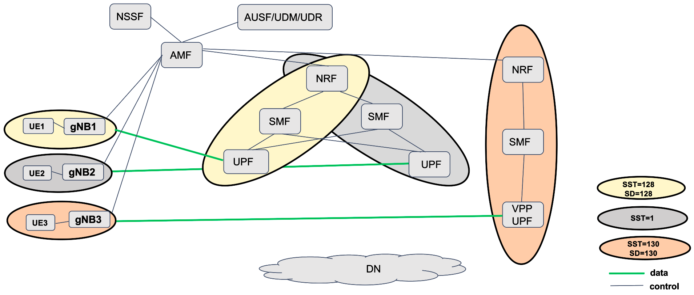

<table style="border-collapse: collapse; border: none;">
  <tr style="border-collapse: collapse; border: none;">
    <td style="border-collapse: collapse; border: none;">
      <a href="http://www.openairinterface.org/">
         
         </img>
      </a>
    </td>
    <td style="border-collapse: collapse; border: none; vertical-align: center;">
      <b>OpenAirInterface 5G Core Network Deployment and Testing with gnbsim</b>
    </td>
  </tr>
</table>

**CAUTION: 2021/12/12: This page may be obsolete and needs update.**

**Reading time: ~ 30mins**

**Tutorial replication time: ~ 1h30mins**

Note: In case readers are interested in deploying debuggers/developers core network environment with more logs please follow [this tutorial](./DEBUG_5G_CORE.md)

**TABLE OF CONTENTS**

1.  Pre-requisites
2.  Building Container Images
3.  Configuring Host Machines
4.  Configuring OAI 5G Core Network Functions
5.  Deploying OAI 5G Core Network
6.  [Getting a `gnbsim` docker image](#6-getting-a-gnbsim-docker-image)
7.  [Executing `gnbsim` Scenario](#7-executing-the-gnbsim-scenario)
8.  [Analysing Scenario Results](#8-analysing-the-scenario-results)
9.  [Trying some advanced stuff](#9-trying-some-advanced-stuff)
