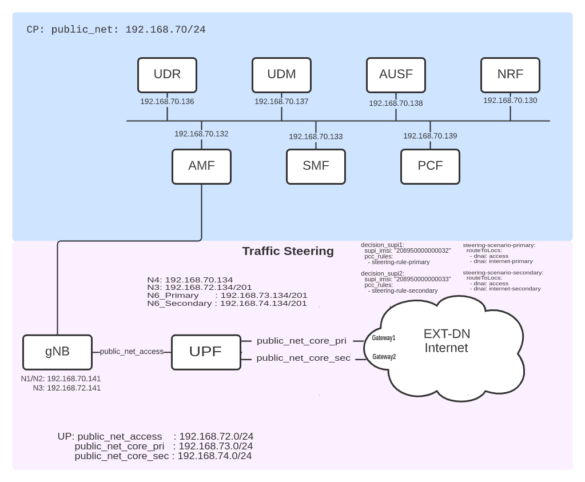

<table style="border-collapse: collapse; border: none;">
  <tr style="border-collapse: collapse; border: none;">
    <td style="border-collapse: collapse; border: none;">
      <a href="http://www.openairinterface.org/">
         
         </img>
      </a>
    </td>
    <td style="border-collapse: collapse; border: none; vertical-align: center;">
      <b>OpenAirInterface 5G Core UL CL Network Deployment and Testing With Gnbsim</b>
    </td>
  </tr>
</table>

**Reading time: ~ 20 minutes**

**Tutorial replication time: ~ 1h**

**Compute resource recommendation: ~ 6GB RAM, 8CPU**

Note: In case readers are interested in deploying debuggers/developers core network environment with more logs please follow [this tutorial](./DEBUG_5G_CORE.md)

**TABLE OF CONTENTS**

1. [Pre-requisites](#1-pre-requisites)
2. [Building Container Images](./BUILD_IMAGES.md) or [Retrieving Container Images](./RETRIEVE_OFFICIAL_IMAGES.md)
3. [Deploying OAI 5G Core Network](#3-deploying-oai-5g-core-network)
4. [Simulate with gnbsim](#4-simulate-with-gnbsim)

8. [Trace Analysis](#8-trace-analysis)
9. [Undeploy Network Functions](#9-undeploy-network-functions)
10. [Conclusion](#10-conclusion)

For this demo, all the images which use the `develop` branch have been retrieved from the official `docker-hub` (see also
[Retrieving images](./RETRIEVE_OFFICIAL_IMAGES.md)).

| NF Name | Branch Name | Tag used at time of writing | Ubuntu 18.04 | RHEL8 |
|----------|:------------|-----------------------------|--------------|-------|
| NSSF     | `develop`    | `v1.5.0`                    | X            | -     |
| AMF      | `develop`    | `v1.5.0`                    | X            | -     |
| AUSF     | `develop`    | `v1.5.0`                    | X            | -     |
| NRF      | `develop`    | `v1.5.0`                    | X            | -     |
| SMF      | `develop`    | `v1.5.0`                    | X            | -     |
| UDR      | `develop`    | `v1.5.0`                    | X            | -     |
| UDM      | `develop`    | `v1.5.0`                    | X            | -     |
| PCF      | `develop`    | `v1.5.0`                    | X            | -     |
| UPF-VPP  | `develop`    | `V1.5.0`                    | X            | -     |

 

This tutorial shows how to configure the Traffic Steering and Redirection feature at SMF and UPF, based on policies from the PCF.

## 1. Pre-requisites
## 3. Deploying OAI 5g Core Network
