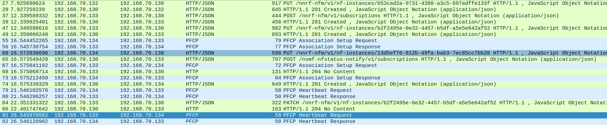
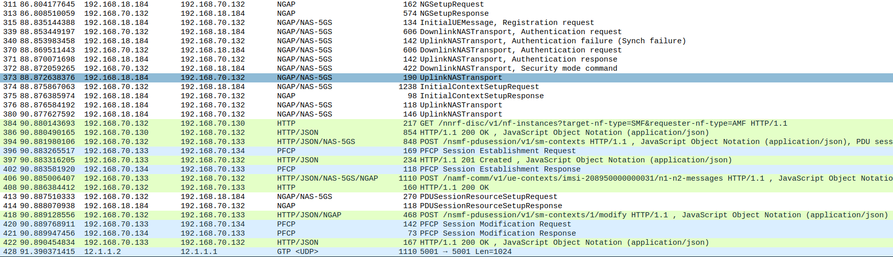
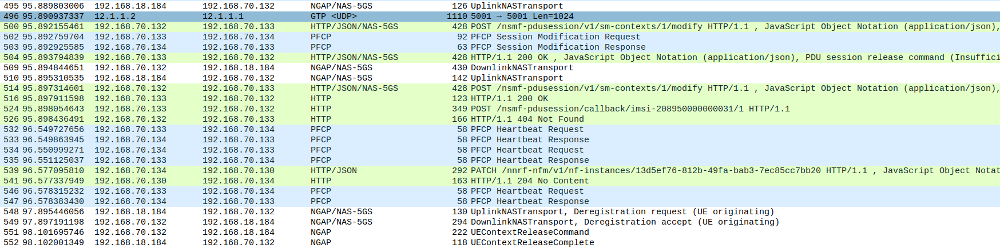

<table style="border-collapse: collapse; border: none;">
  <tr style="border-collapse: collapse; border: none;">
    <td style="border-collapse: collapse; border: none;">
      <a href="http://www.openairinterface.org/">
         
         </img>
      </a>
    </td>
    <td style="border-collapse: collapse; border: none; vertical-align: center;">
      <b><font size = "5">OpenAirInterface 5G Core Network Deployment with FQDN enabled using the Docker-Compose and Testing with dsTest</font></b>
    </td>
  </tr>
</table>


This tutorial will help in understanding how to deploy OAI core network using docker-compose. In this tutorial we have used [dsTest](https://www.developingsolutions.com/products/dstest-5g-core-network-testing/) a commercial paid gNB emulator. Though instead of this readers can also use gNBsim (an opensource gNB emulator), you can follow another tutorial for [this](./DEPLOY_SA5G_WITH_GNBSIM.md). Please follow the tutorial step by step to create a stable working testbed. 

**Reading time: ~20mins**

**Tutorial replication time: ~1hr**

Note: In case readers are interested in deploying debuggers/developers core network environment with more logs please follow [this tutorial](./DEBUG_5G_CORE.md)

**TABLE OF CONTENTS**

1.  [Overview](#1-overview)
2.  [Pre-requisites](#2-pre-requisites)
3.  [Network Function Container Images](#3-network-function-container-images)
4.  [Configuring Host Machines](#4-configuring-host-machines)
5.  [Configuring OAI 5G Core Network Functions](#5-configuring-the-oai-5g-core-network-functions)
6.  [Configuring dsTest Scenario](#6-configuring-dstester-scenario)
7.  [Deploying OAI 5G Core Network](#7-deploying-oai-5g-core-network)
8.  [Executing dsTest Scenario](#8-executing-the-dstest-scenario)
9.  [Analysing Scenario Results](#9-analysing-the-scenario-results)
10. [Demo Video](#10-demo-video)
11. [Notes](#11-notes)

## 1. Overview ##

Here you will find how one can deploy the 5G core network in multiple ways with minimum/basic functional architecture.

- Minimal functional 5g core network
    - Scenario I:  `AMF, SMF, UPF (SPGWU), NRF, MYSQL`
    - Scenario II:  `AMF, SMF, UPF (SPGWU), MYSQL`
- Basic functional 5g core network
    - Scenario I:  `AMF, SMF, UPF (SPGWU), NRF, UDM, UDR, AUSF, MYSQL`
    - Scenario II:  `AMF, SMF, UPF (SPGWU), UDM, UDR, AUSF, MYSQL`

## 2. Pre-requisites ##

The container images are built using `docker build` command on Ubuntu 18.04 host machine. The base image for all the containers is Ubuntu 18.04. 

The requried softwares and their respected versions are listed below. To replicate the testbed use these versions. 


| Software                   | Version                         |
|:-------------------------- |:------------------------------- |
| docker engine              | 19.03.6, build 369ce74a3c       |
| docker-compose             | 1.27.4, build 40524192          |
| Host operating system      | Ubuntu 18.04.4 LTS              |
| Container operating system | Ubuntu 18.04                    |
| dsTest (Licensed)          | 5.5                             |
| tshark                     | 3.4.4 (Git commit c33f6306cbb2) |
| wireshark                  | 3.4.4 (Git commit c33f6306cbb2) |

The new version of `wireshark` may not be available in the ubuntu repository so it is better to build it from source.

Most of the times the `docker-compose-host` machine is not configured with packet forwarding then it can be done using below command (if you have already done it in any other section then don't repeat).

**This is the most important step towards end-to-end connectivity.**

```bash
(docker-compose-host)$ sudo sysctl net.ipv4.conf.all.forwarding=1
(docker-compose-host)$ sudo iptables -P FORWARD ACCEPT
```

To know how to configure the machine with the above requirements vist [pre-requisites](./DEPLOY_PRE_REQUESITES.md) page.

## 3. Network Function Container Images ##

- In this demo the network function branch and tags which were used are listed below, follow the [Retrieving images](./RETRIEVE_OFFICIAL_IMAGES.md) or the [Building images](./BUILD_IMAGES.md) to build images with below tags.

| CNF Name    | Branch Name | Tag      | Ubuntu 18.04 | RHEL8 (UBI8)    |
| ----------- | ----------- | -------- | ------------ | ----------------|
| AMF         | `master`    | `v1.2.0` | X            | X               |
| SMF         | `master`    | `v1.2.0` | X            | X               |
| NRF         | `master`    | `v1.2.0` | X            | X               |
| SPGW-U-TINY | `master`    | `v1.2.0` | X            | X               |
| UDR         | `master`    | `v1.2.0` | X            | X               |
| UDM         | `master`    | `v1.2.0` | X            | X               |
| AUSF        | `master`    | `v1.2.0` | X            | X               |

- In case readers are interested in making images using different branch then **they have to build images from scratch they can't use the docker-hub images**.

## 4. Configuring Host Machines ##

All the network functions are connected using `demo-oai` bridge.

There are two ways to create this bridge either manually or automatically using docker-compose.

* The manual version will allow packet capturing while network functions are getting deployed. So the initial tested setup packets can be captured for debugging purposes or checking if network functions registered properly to NRF. 
* The second option of automatic deployment is good when initial packet capture is not important.

**NOTE** This tutorial needs that the bridge is created manually to analyse NRF packet exchange. 

### 4.1 Creating bridge manually

- The bottom section of [docker-compose file](../docker-compose/docker-compose-basic-nrf.yaml) SHALL look like this:

```
    networks:
          public_net:
              external:
                  name: demo-oai-public-net
        # public_net:
        #     driver: bridge
        #     name: demo-oai-public-net
        #     ipam:
        #         config:
        #             - subnet: 192.168.70.128/26
        #     driver_opts:
        #         com.docker.network.bridge.name: "demo-oai"
```

- The `docker-compose-host` machine needs to be configured with `demo-oai` bridge before deploying core network components. To capture initial message exchange between smf<-->nrf<-->upf.

    ```bash
    (docker-compose-host)$ docker network create \
      --driver=bridge \
      --subnet=192.168.70.128/26 \
      -o "com.docker.network.bridge.name"="demo-oai" \
      demo-oai-public-net
    455631b3749ccd6f10a366cd1c49d5a66cf976d176884252d5d88a1e54049bc5
    (docker-compose-host)$ ifconfig demo-oai
    demo-oai: flags=4099<UP,BROADCAST,MULTICAST>  mtu 1500
            inet 192.168.70.129  netmask 255.255.255.192  broadcast 192.168.70.191
            RX packets 0  bytes 0 (0.0 B)
            RX errors 0  dropped 0  overruns 0  frame 0
            TX packets 0  bytes 0 (0.0 B)
            TX errors 0  dropped 0 overruns 0  carrier 0  collisions 0
    (docker-compose-host)$ docker network ls
    NETWORK ID          NAME                  DRIVER              SCOPE
    d2d34e05bb2d        bridge                bridge              local
    455631b3749c        demo-oai-public-net   bridge              local
    ```

### 4.2 Create bridge automatically  

- Though the bridge can be automatically created using docker-compose file if there is no need to capture initial packets.

This is the `default` version in the available docker-compose [files](../docker-compose/).

The bottom section SHALL look like this:

    ```
    networks:
        # public_net:
        #     external:
        #         name: demo-oai-public-net
          public_net:
              driver: bridge
              name: demo-oai-public-net
              ipam:
                  config:
                      - subnet: 192.168.70.128/26
              driver_opts:
                  com.docker.network.bridge.name: "demo-oai"
    ```

### 4.3 In case you forgot. True for manual or automatic network creation.

- If the `docker-compose-host` machine is not configured with packet forwarding then it can be done using below command (**important step**), 

    ```bash
    (docker-compose-host)$ sudo sysctl net.ipv4.conf.all.forwarding=1
    (docker-compose-host)$ sudo iptables -P FORWARD ACCEPT
    ```

- The `dsTest-host` needs to configured with a route to reach `docker-compose-host`. Assuming `dsTest-host` physical interface which is connected with `docker-compose-host` is NIC1 and the ip-address of this interface is IP_ADDR_NIC1 then,

    ```bash
    (dsTest-host)$ sudo ip route add route 192.168.70.128/26 \
                           via IP_ADDR_NIC1\
                           dev NIC1_NAME
    ```

- To verify ping the ip-address of the `docker-compose-host` interface connected to demo-oai bridge, if possible also ping amf from the dsTest-host machine.

    ```bash
    (dsTest-host)$ ping 192.168.70.129
    PING 192.168.70.129 (192.168.70.129) 56(84) bytes of data.
    64 bytes from 192.168.70.129: icmp_seq=1 ttl=64 time=0.260 ms
    64 bytes from 192.168.70.129: icmp_seq=2 ttl=64 time=0.147 ms
    64 bytes from 192.168.70.129: icmp_seq=3 ttl=64 time=0.187 ms
    64 bytes from 192.168.70.129: icmp_seq=4 ttl=64 time=0.187 ms
    64 bytes from 192.168.70.129: icmp_seq=5 ttl=64 time=0.181 ms
    ^C
    --- 192.168.70.129 ping statistics ---
    5 packets transmitted, 5 received, 0% packet loss, time 108ms
    rtt min/avg/max/mdev = 0.147/0.192/0.260/0.038 ms    
    ```
    
## 5. Configuring the OAI-5G Core Network Functions ##

- **Core Network Configuration**: The docker-compose file has configuration parameters of each core network component. The file is pre-configured with parameters related to this scenario. The table contains the location of the configuration files. These files contains allowed configurable parameters. **Keep checking this file it is possible that we will add new parameters for new features.**  

    | File Name   | Repository                                   | Location        |
    |:----------- |:-------------------------------------------- |:--------------- |
    | amf.conf    | (Gitlab) cn5g/oai-cn5g-amf                   | [etc/amf.conf](https://gitlab.eurecom.fr/oai/cn5g/oai-cn5g-amf/-/blob/develop/etc/amf.conf)    |
    | smf.conf    | (Gitlab) cn5g/oai-cn5g-smf                   | [etc/smf.conf](https://gitlab.eurecom.fr/oai/cn5g/oai-cn5g-smf/-/blob/develop/etc/smf.conf)    |
    | nrf.conf    | (Gitlab) cn5g/oai-cn5g-nrf                   | [etc/nrf.conf](https://gitlab.eurecom.fr/oai/cn5g/oai-cn5g-nrf/-/blob/develop/etc/nrf.conf)   |
    | spgw_u.conf | (Github) OPENAIRINTERFACE/openair-spgwu-tiny | [etc/spgw_u.conf](https://github.com/OPENAIRINTERFACE/openair-spgwu-tiny/blob/gtp_extension_header/etc/spgw_u.conf) |
    | udr.conf    | (Gitlab) cn5g/oai-cn5g-udr                   | [etc/udr.conf](https://gitlab.eurecom.fr/oai/cn5g/oai-cn5g-udr/-/blob/develop/etc/udr.conf)   |
    | udm.conf    | (Gitlab) cn5g/oai-cn5g-udm                   | [etc/udm.conf](https://gitlab.eurecom.fr/oai/cn5g/oai-cn5g-udm/-/blob/develop/etc/udm.conf)   |
    | ausf.conf   | (Gitlab) cn5g/oai-cn5g-ausf                  | [etc/ausf.conf](https://gitlab.eurecom.fr/oai/cn5g/oai-cn5g-ausf/-/blob/develop/etc/ausf.conf)   |


- **User Subscprition Profile**: 
    - Minimum functional: The dsTest UE which will request for a PDU session will have this user profile. Verify that this entry is present in the oai_db.sql file located in [docker-compose/oai-db1.sql](../docker-compose/oai_db1.sql).  

    ```
    IMSI - 208950000000031
    IMEI - 55000000000001
    Secret Key (K) - 0x0C0A34601D4F07677303652C0462535B
    OPc - 0x63bfa50ee6523365ff14c1f45f88737d
    ``` 

    - Optional: Incase, the user subscription entry is missing from oai_db1.sql file then it can be added using below commands,

    ```bash
    #Login to mysql container once the container is running
    (docker-compose-host)$ docker exec -it mysql /bin/bash
    (mysql-container)$ mysql -uroot -plinux -D oai_db
    mysql> INSERT INTO users VALUES
    ('208950000000031','380561234567','55000000000001',NULL,'PURGED',50,40000000,100000000,47,0000000000,1,0x0C0A34601D4F07677303652C0462535B,0,0,0x40,'ebd07771ace8677a',0x63bfa50ee6523365ff14c1f45f88737d);
    ```
    - Basic functional: The dsTest UE which will request for a PDU session will have this user profile. Verify that this entry is present in the oai_db.sql file located in [docker-compose/oai-db2.sql](../docker-compose/oai_db2.sql).  

    ```
    IMSI - 208950000000031
    IMEI - 55000000000001
    Secret Key (K) - 0x0C0A34601D4F07677303652C0462535B
    OPc - 0x63bfa50ee6523365ff14c1f45f88737d
    ``` 

    - Optional: Incase, the user subscription entry is missing from oai_db2.sql file then it can be added using below commands,

    ```bash
    #Login to mysql container once the container is running

    ```

## 6. Configuring DsTester Scenario ##

- **User Subscription Profile**: 
    - Minimum functional: The user profile used for dsTest scenario is below. Verify that this entry is present in the oai_db1.sql file located in docker-compose/oai-db1.sql.  

    ```
    IMSI - 208950000000031
    IMEI - 55000000000001
    Secret Key (K) - 0x0C0A34601D4F07677303652C0462535B
    OPc - 0x63bfa50ee6523365ff14c1f45f88737d
    ```
    - Basic functional: The user profile used for dsTest scenario is below. Verify that this entry is present in the oai_db2.sql file located in docker-compose/oai-db2.sql.  

    ```
    IMSI - 208950000000031
    IMEI - 55000000000001
    Secret Key (K) - 0x0C0A34601D4F07677303652C0462535B
    OPc - 0x63bfa50ee6523365ff14c1f45f88737d
    ```

- **gNB Parameters for dsTest**: 

    ```
    TAC - 0xa000
    MCC - 208
    MNC - 95
    NSSAI SST - 222
    NSSAI SD - 123
    ```

- [SmartEvents State Machine](https://www.developingsolutions.com/Help/Topics/SmartFlow-SmartEvents-State-Machines.htm) used for this dsTest scenario is below, the number on each arrow between different states depicts transition interval in milli seconds. 


## 7. Deploying OAI 5g Core Network ##

- The core network is deployed using a [python script](../docker-compose/core-network.py) which is a wrapper around `docker-compose` and `docker` command. 
- The script informs the user when the core-network is correctly configured by checking health status of containers and connectivity between different core network components.
- To know how to use the script look for the helper menu as shown below.
- There are three parameters, which can be provided 
  - `--type` mandatory option to start/stop the 5g core components with minimum/basic functional architecture. 
  - `--fqdn` and `--scenario` are optional and if not provided by default it is considered as use fqdn feature with nrf component.
- In case if there is a problem in using the script then use docker-compose manually read the [notes section](#10-notes) 

    ```bash
    (docker-compose-host)$ pwd
    /home/<docker-compose-host>/oai/oai-cn-fed/docker-compose
    (docker-compose-host)$ python3 core-network.py --help

    usage: core-network.py [-h] --type {start-mini,start-basic,stop-mini,stop-basic} [--fqdn {yes,no}] [--scenario {1,2}]

    OAI 5G CORE NETWORK DEPLOY

    optional arguments:
    -h, --help            show this help message and exit
    --type {start-mini,start-basic,stop-mini,stop-basic}, -t {start-mini,start-basic,stop-mini,stop-basic}
                            Functional type of 5g core network ("start-mini"|"start-basic"|"stop-mini"|"stop-basic")
    --fqdn {yes,no}, -fq {yes,no}
                            Deployment scenario with FQDN ("yes"|"no")
    --scenario {1,2}, -s {1,2}
                            Scenario with NRF ("1") and without NRF ("2")

    example:
            python3 core-network.py --type start-mini
            python3 core-network.py --type start-basic
            python3 core-network.py --type stop-mini
            python3 core-network.py --type start-mini --fqdn no --scenario 2
            python3 core-network.py --type start-basic --fqdn no --scenario 2
    ```
- Before executing the script it is better to start capturing packets to see the message flow between smf <--> nrf <--> upf. The packets will be captured on **demo-oai** bridge which should be configured on the `docker-compose-host` machine. 

    ```bash
    (docker-compose-host)$ tshark -i demo-oai -w 5gcn-deployment.pcap
    ```
- Starting the core network components, 

    ```bash
    (docker-compose-host)$ python3 core-network.py --type start-basic
    [2021-09-07 10:19:02,399] root:DEBUG:  Starting 5gcn components... Please wait....
    Creating network "demo-oai-public-net" with driver "bridge"
    Creating mysql   ... done
    Creating oai-nrf ... done
    Creating oai-udr ... done
    Creating oai-udm ... done
    Creating oai-ausf ... done
    Creating oai-amf  ... done
    Creating oai-smf  ... done
    Creating oai-spgwu ... done
    Creating oai-ext-dn ... done

    [2021-09-07 10:19:37,540] root:DEBUG:  OAI 5G Core network started, checking the health status of the containers... takes few secs....
    [2021-09-07 10:20:15,328] root:DEBUG:  All components are healthy, please see below for more details....
    Name                 Command                  State                  Ports            
    -----------------------------------------------------------------------------------------
    mysql        docker-entrypoint.sh mysqld      Up (healthy)   3306/tcp, 33060/tcp         
    oai-amf      /bin/bash /openair-amf/bin ...   Up (healthy)   38412/sctp, 80/tcp, 9090/tcp
    oai-ausf     /bin/bash /openair-ausf/bi ...   Up (healthy)   80/tcp                      
    oai-ext-dn   /bin/bash -c  apt update;  ...   Up                                         
    oai-nrf      /bin/bash /openair-nrf/bin ...   Up (healthy)   80/tcp, 9090/tcp            
    oai-smf      /bin/bash /openair-smf/bin ...   Up (healthy)   80/tcp, 8805/udp, 9090/tcp  
    oai-spgwu    /openair-spgwu-tiny/bin/en ...   Up (healthy)   2152/udp, 8805/udp          
    oai-udm      /bin/bash /openair-udm/bin ...   Up (healthy)   80/tcp                      
    oai-udr      /bin/bash /openair-udr/bin ...   Up (healthy)   80/tcp
    [2021-09-07 10:20:15,328] root:DEBUG:  Checking if the containers are configured....
    [2021-09-07 10:20:15,328] root:DEBUG:  Checking if SMF and UPF registered with nrf core network....
    [2021-09-07 10:20:15,366] root:DEBUG:  For example: oai-smf Registration with oai-nrf can be checked on this url /nnrf-nfm/v1/nf-instances?nf-type="SMF" {"_links":{"item":[{"href":"192.168.70.133"}],"self":""}}....
    [2021-09-07 10:20:15,366] root:DEBUG:  SMF and UPF are registered to NRF....
    [2021-09-07 10:20:15,366] root:DEBUG:  Checking if SMF is able to connect with UPF....
    [2021-09-07 10:20:15,493] root:DEBUG:  UPF receiving heathbeats from SMF....
    [2021-09-07 10:20:15,493] root:DEBUG:  OAI 5G Core network is configured and healthy....
    ```

## 8. Executing the dsTest Scenario ##

- **Optional**, in case there is a need to maintain two different pcap files one for capturing initial message exchange between core network components and second for scenario execution then stop the previous packet capturing process and run a new one,

    ``` bash
    (docker-compose-host)$ tshark -i demo-oai -w scenario-execution.pcap    
    ```

- **Scenario Execution**: On the dsTest host run the scenario either using the dsClient GUI or command line. Below are the commands to run it using the command line.

    ```bash
    (dsTest-host)$ dsClient -d 127.0.0.1 -c "source dsTestScenario.xml"
    ```
- **Verify PDN session establishment**: To check if a PDN session is properly estabilished there is an extra external data network container only for this demo purpose. The dsTest UE can be reached using this container to validate the PDN session establishment. To understand the packet flow read the next analysis section. In our settings the UE network is 12.1.1.0/24 the configuration can be seen in smf.conf and spgw_u.conf. The allocated IP address to dsTest UE can be seen in smf logs. Generally, if there is a single UE then the allocated ip address will be 12.1.1.2.

    ```bash
    (docker-compose-host)$ docker exec -it oai-ext-dn ping 12.1.1.2
    64 bytes from 12.1.1.2: icmp_seq=3 ttl=63 time=0.565 ms
    64 bytes from 12.1.1.2: icmp_seq=4 ttl=63 time=0.629 ms
    64 bytes from 12.1.1.2: icmp_seq=5 ttl=63 time=0.542 ms
    64 bytes from 12.1.1.2: icmp_seq=6 ttl=63 time=0.559 ms
    ^c
    ```

- **Stop PCAP collection**: Stop the wireshark or tshark process on the docker-compose-host.

- **Undeploy the core network**: Before undeploying collect all the logs from each component for analysis. 

    ```bash
    (docker-compose-host)$ docker logs oai-amf > amf.log
    (docker-compose-host)$ docker logs oai-smf > smf.log
    (docker-compose-host)$ docker logs oai-nrf > nrf.log
    (docker-compose-host)$ docker logs oai-spgwu > spgwu.log  
    (docker-compose-host)$ docker logs oai-udr > udr.log
    (docker-compose-host)$ docker logs oai-udm > udm.log
    (docker-compose-host)$ docker logs oai-ausf > ausf.log
    (docker-compose-host)$ python3 core-network.py --type stop-basic
    Stopping oai-ext-dn ... done
    Stopping oai-spgwu  ... done
    Stopping oai-smf    ... done
    Stopping oai-amf    ... done
    Stopping oai-ausf   ... done
    Stopping oai-udm    ... done
    Stopping oai-udr    ... done
    Stopping mysql      ... done
    Stopping oai-nrf    ... done
    Removing oai-ext-dn ... done
    Removing oai-spgwu  ... done
    Removing oai-smf    ... done
    Removing oai-amf    ... done
    Removing oai-ausf   ... done
    Removing oai-udm    ... done
    Removing oai-udr    ... done
    Removing mysql      ... done
    Removing oai-nrf    ... done
    Removing network demo-oai-public-net

    [2021-09-07 11:06:48,922] root:DEBUG:  OAI 5G core components are UnDeployed....
    ```

## 9. Analysing the Scenario Results ##

This section is subdivided in two parts the first part for analysing the message exchange between core network components at the time of deployment. Second, for analysing the dsTest scenario.

| Container     | Ip-address     |
| ------------- |:-------------- |
| mysql         | 192.168.70.131 |
| oai-amf       | 192.168.70.132 |
| oai-smf       | 192.168.70.133 |
| oai-nrf       | 192.168.70.130 |
| oai-spgwu     | 192.168.70.134 |
| oai-ext-dn    | 192.168.70.135 |
| oai-udr       | 192.168.70.136 |
| oai-udm       | 192.168.70.137 |
| oai-ausf      | 192.168.70.138 |
| Host Machine  | 192.168.70.129 |
| dsTest gNB/UE | 192.168.18.184 |


| Pcap/log files                                                                                           |
|:-------------------------------------------------------------------------------------------------------- |
| [5gcn-deployment.pcap](./results/dsTest/pcap/5gcn-deployment.pcap)                                       |
| [scenario-execution.pcap](./results/dsTest/pcap/scenario-execution.pcap)                                 |
| [amf.log](./results/dsTest/logs/amf.log), [initialmessage.log](./results/dsTest/logs/initialmessage.log) |
| [smf.log](./results/dsTest/logs/smf.log)                                                                 |
| [nrf.log](./results/dsTest/logs/nrf.log)                                                                 |
| [spgwu.log](./results/dsTest/logs/spgwu.log)                                                             |
| [udr.log](./results/dsTest/logs/udr.log)                                                                 |
| [udm.log](./results/dsTest/logs/udm.log)                                                                 |
| [ausf.log](./results/dsTest/logs/ausf.log)                                                               |


### Analysing initial message exchange

Using wireshark open 5gcn-deployment.pcap use the filter http || pfcp

- SMF request to NRF for subscribing UPF registration/de-registration events: Packet 13, POST request 
- SMF registration with NRF: Packet 23, PUT request
- UPF(SPGWU) registration with NRF: Packet 35, PUT request
- NRF notification to SMF for UPF registration: Packet 40, POST request
- SMF <--> UPF PFCP Association Setup request and response: Packet 42, 46
- Message exchange between SMF, NRF and UPF can be seen in nrf.log but the name of the network function is replaced with a unique identifier (UUID). 




### Analysing scenario execution

Using wireshark open scenario-execution.pcap use the filter ngap || http || pfcp || gtp

- NG Setup request reponse: Packet 19,21
- Initial UE Message registration request: Packet 23
- Authentication and security processL: Packet 49-52
- Registration complete: Packet 55
- PDU session establishment request: Packet 72
- AMF requesting NRF for SMF address: Packet 78 & 80 GET Request
- AMF <--> SMF PDU session request: Packet 90 & 92 POST Request
- SMF <--> UPF PFCP session establishment: Packet 93 & 98
- Allocated UE IP-address can be seen in Packet 93, 102, 109
- Echo request response between UE and oai-ext-dn container: Packet 129, 130



- UE PDU session release request: Packet 394
- AMF <--> SMF PDU session release request: Packet 398
- NGreset : Packet 473




## 10. Demo Video ##

- Here is the link to the [youtube video](https://www.youtube.com/watch?v=ENQiwl2EYl8) 

## 11. Notes ##

- The `oai-ext-dn` container is optional and is only required if the user wants to ping the dsTest UE. In general this container is not required except for testing purposes.
- Using the python script from above you can perform minimum `AMF, SMF, UPF (SPGWU), NRF, MYSQL` and basic `AMF, SMF, UPF (SPGWU), NRF, UDM, UDR, AUSF, MYSQL` 5g core funtional testing with `FQDN/IP` based feature along with `NRF/noNRF`. Check the configuration before using the docker compose [files](../docker-compose/).
- This tutorial can be taken as reference to test the OAI 5G core with a COTS UE. The configuration files has to be changed according to the gNB and COTS UE information should be present in the mysql database. 
- Generally, in a COTS UE two PDN sessions are created by default so configure the IMS in SMF properly. Currently some parameters can not be configured via [docker-compose-basic-nrf.yaml](../docker-compose/docker-compose-basic-nrf.yaml). We recommend you directly configure them in the conf file and mount the file in the docker during run time. 
- Its not necessary to use [core-network.py](../docker-compose/core-network.py) bash script, it is possible to directly deploy using `docker-compose` command
- In case you want to deploy debuggers/developers core network environment with more logs please follow [this tutorial](./DEBUG_5G_CORE.md)

    ```
    #To start the containers 
    docker-compose -f <file-name> up -d
    #To check their health status
    docker-compose -f <file-name> ps -a
    #To stop the containers 
    docker-compose -f <file-name> down
    ```
