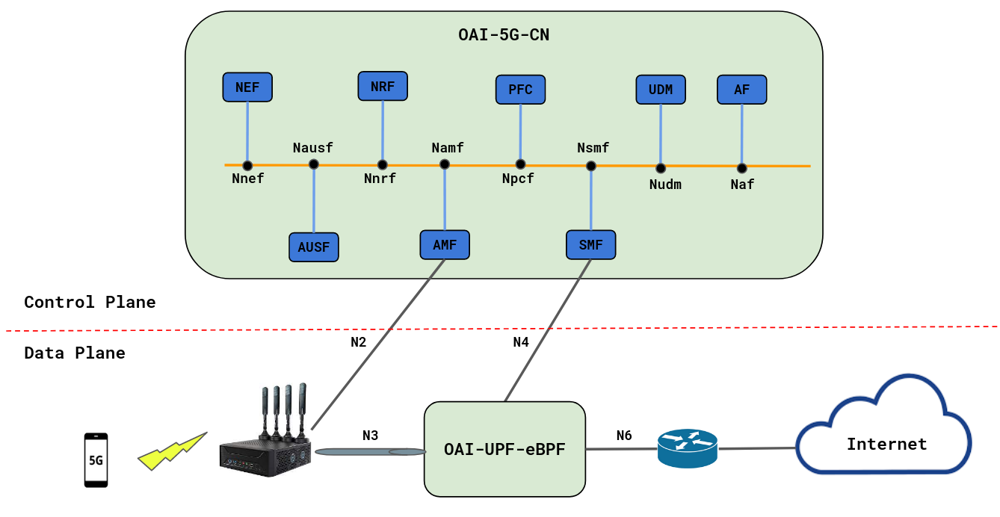

<table style="border-collapse: collapse; border: none;">
  <tr style="border-collapse: collapse; border: none;">
    <td style="border-collapse: collapse; border: none;">
      <a href="http://www.openairinterface.org/">
         
         </img>
      </a>
    </td>
    <td style="border-collapse: collapse; border: none; vertical-align: center;">
      <b><font size = "5">OpenAirInterface 5G Core Network Deployment with eBPF-UPF using docker-compose</font></b>
    </td>
  </tr>
</table>


**Reading time: ~ 50mins**

**Tutorial replication time: ~ 1h30mins**

Note: In case readers are interested in deploying debuggers/developers core network environment with more logs, please follow [this tutorial](./DEBUG_5G_CORE.md)

**TABLE OF CONTENTS**

1.  [Understanding the (e)BPF-XDP](#1-understanding-ebpf-xdp)
    1.  [(extended) Berkeley Packet Filtering ((e)BPF)](#1-1-ebpf)
    2.  [eXpress Data Path (XDP)](#1-xdp)
2.  [UPF Architecture](#2-upf-architecture)
    1.  [Management layer](#1-management-layer)
    2.  [Datapath layer](#2-datapath-layer)
3.  [OAI 5G Testbed](#3-oai-5g-testbed)
4.  [Pre-requisites](#4-pre-requisites)
    1.  [5G CN pre-requisites](#1-cn-pre-requisites)
    2.  [UPF pre-requisistes](#2-upf-pre-requisites)
5.  [Deployment](#4-deployment)
2.  [Building Container Images](./BUILD_IMAGES.md) or [Retrieving Container Images](./RETRIEVE_OFFICIAL_IMAGES.md)
3.  Configuring Host Machines
4.  Configuring OAI 5G Core Network Functions
5.  [Deploying OAI 5G Core Network with VPP-UPF](#5-deploying-oai-5g-core-network)
6.  [Stimuli with a RAN emulator](#6-stimuli-with-a-ran-emulator)
7.  [Recover the logs](#7-recover-the-logs)
8.  [Undeploy the Core Network](#8-undeploy-the-core-network)
9.  [Notes](#9-notes)


-----------------------------------------------------------------------------------------
## 1. Understanding the (e)BPF-XDP

### i. (extended) Berkeley Packet Filtering ((e)BPF)
The eBPF is a virtual machine having its origins in the Linux kernel. It runs sandboxed programs in a privileged mode (e.g. OS kernel) to *__safely__* and *__efficiently__* extend the capabilities of the kernel with custom code that can be injected at run-time without requiring to changes in the kernel source code or load kernel modules. The eBPF is an *event-driven* program that is triggered when the kernel or application passes a certain *hook point*. eBPF has some predefined hook points that include system calls, every kernel function, kernel trace points, and network events, to name few. If a predefined hook does not exists for a particular need, it is possible to create one at kernel probe or user probe, almost anywhere.

An eBPF program follows several steps before being executed. Series of components are used at these steps to compile, verify, and execute the eBPF program. 
  - It starts by a __compilation step__, where eBPF programs leverage a special bytecode stored by *libelf* in an Executable and Linkable Forma (ELF) object file that is generated by the *Clang/LLVM* toolchain starting from a source code written in a (restricted) C language. 
  - This is followed by a __loading step__, where *libbpf* loads the ELF file (i.e., bytecode) to the identified hook point, via system calls. 
  - Upon injection, the bytecode goes through __verification step__ to be analyzed and verified, whose aim is to guarantee that the code cannot harm the kernel, for example checking that only allowed memory accesses are performed and that the program will eventually terminate (i.e., no infinite loops). As a consequence, eBPF programs must use some limitations, such as a maximum number of instructions and the non support for infinite loops. Moreover, the only way to access memory is to use *maps*, which are set of key-value stores with different access semantics (e.g., array, hash, and queue), that can be shared between eBPF programs and user space. 
  - After the program is verified, it goes through the final step before execution; __Just-In-Time (JIT) Compilation__. Here the generic bytecode is translated into machine specific instruction set to optimize the execution speed of the program. This makes the eBPF programs run efficiently as native compiled kernel code. 


### ii. eXpress Data Path (XDP)
XDP is a *high-performance packet processing* framework, enabling Datapath (DP) network packets processing in the Linux kernel at the earliest stage of the networking stack. It is located in the reception chain of the *network device driver* before the Socket Buffer Allocation (SKB), referred as hook point. XDP allows the execution of custom eBPF programs written in C and compiled into *eBPF bytecode*. These eBPF programs are ran as soon as possible, usually *immediately* on packet reception at the network interface. This early interception makes XDP highly efficient and suitable for use cases that require low-latency and high-performance packet handling.

XDP provides three models to *link and attach* eBPF programs to a network interface: (i) *Generic XDP* - It is loaded into the kernel as part of the ordinary network path. It is an easy way, mostly, used to test XDP programs on any (generic) hardware. However, this model does not provide full performance benefits.
(ii) *Native XDP* - Loaded by the network card driver as part of its initial receive path. While it requires the support from the network card driver, this solution offers better performances.
 (iii) *Offloaded XDP* - Loaded directly on the network interface card, and it is executed without using the CPU. It requires support from the network interface device.
 We may mention that *not* all the network device drivers implement XDP hooks, in such case, we use generic XDP hook. In Linux 4.18 and later, XDP hooks are supported by the following network device drivers: Veth, Virtio_net, Tap, Tun, Qede, Thunder, Bnxt, Lxgbe, Nfp, I40e, Mlx5, and MLX4. 
 

In what follows, we describe the main steps in the XDP call flow.
  - (1) __Packet Arrival__: At a packet reception by the NIC, the network driver is notified, which passes the packet to the XDP program attached to the interface.
  - (2) __XDP Program Execution__: The XDP program is executed by the eBPF virtual machine. The program can perform various operations on the packet, such as packet filtering, forwarding, or modification. Based on the logic defined in the XDP program, the program returns a verdict to the XDP hook.
  - (3) __Verdict Decision__: The XDP program returns one of several verdict options, in the form of a program return code, to indicate the desired action for the packet (ie.,  (drop it, pass it or forward it). This return code is a positive integer between 0 and 4 mapping predefined actions as shown in Table.
  - (4) __Post-XDP Processing__: The driver applies the verdict returned by the XDP program to the packet. If the packet is to be dropped (code 0 or 1), it is immediately discarded. If the packet is to be forwarded or passed to the network stack (code 2, 3 or 4), the driver sets the appropriate fields in the packet's header and passes it along.
  - (5) __Further Processing__: If the packet continues to the Linux networking stack, it undergoes additional processing, such as protocol parsing, routing, and higher-level networking operations.

XDP is widely used in high-performance networking applications, such as NFV, SDN, and DDoS mitigation. It has become a popular tool for accelerating and offloading packet processing from user-space applications to the kernel-space.


| Value       | Action          | Description                                   |
| ----------- |---------------- | --------------------------------------------- |
| 0           | `XDP_ABORTED`   | `eBPF program error, drop the packet`         |
| 1           | `XDP_DROP`      | `Drop the packet`                             |
| 2           | `XDP_PASS`      | `Allow farther processing by network stack`   |
| 3           | `XDP_REDIRECT`  | `Forward the packet to a different interface` |


---------------------------------------------------------------------------------------------------------------------
## 2. UPF Architecture

OAI-UPF-eBPF as a part of the OAI 5G mobile Core Network implements a data network gateway function. It communicates with the SMF via the Packet Forwarding Control Plane (PFCP) protocol (N4 interface) and forwards packets between Access and Data Networks using N3 and N6 interfaces respectively. These two main UPF parts are implemented in two separate components: the Management layer and the Datapath layer.

<figure>
  

  <figcaption><b><font size = "5">Figure 1: UPF Architecture: eBPF XDP based</font></b></figcaption>

### i. Management layer
The Management layer is a user space library, which is responsible about PFCP sessions management. It receives packet processing rules from SMF via the reference point N4, and configures the Datapath for proper forwarding. It implements functions such as `handle_pfcp_session_establishment_request()`, `handle_pfcp_session_modification_request()`, `handle_pfcp_session_deletion_request()`, to respectively create, update and delete a PFCP session. In addition to that, this layer is managing the eBPF programs lifecycle via CRUD functions; that is to say, it creates eBFP sessions (by distinguishing the uplink and downlink directions), update them , or delete them. It also compares PDRs with their precedence, extracts FARs, and creates and manages eBPF Maps, to name few of its role. 

When a PFCP session request is received via the N4 interface, the request is parsed by `PFCP Session Manager`, which calls the `eBPF Program Manager` to dynamically load (update, or delete, respectively) an eBPF bytecode representing the new PFCP session context in case of establishment request (modification request, or deletion request, respectively). 
There is one eBPF program running in kernel space for each PFCP session. The program contains the eBPF maps used to store
the PDRs and FARs. All the communication between the user space and the kernel space is through the libbpf library, which is maintained by the Linux kernel source tree. The PFCP Session Manager parses the structures received to eBPF map
entries and updates the maps accordingly. The PFCP session context is created in Datapath Layer, where the user traffic will be handled. 

### ii. Datapath layer
The Datapath layer is a kernel space layer based on based on eBPF XDP packet processing. Its job is to process the user traffic inside as fast as possible, which imply doing the treatment as close as possible to the NIC by using XDP hooks. When the UPF is started, a service chain function is created within three main components (a Parser, a Detector, and a Forwarder): the `PFCP Session Lookup` as a traffic parser, the `PFCP Session's PDR Lookup` represeting the traffic detector, and the `FAR Program` to forward the traffic. Each of these three main components is an eBPF XDP program, representing a pipeline with several stages. At each stage a decision is made on the packet, weither is will be passed to the next stage (XDP_PASS action), droped for some reasons (XDP_DROP), or redirected (XDP_REDIRECT). 

The Parser (i.e., PFCP Session Lookup) parses the ingress traffic to check if it is an uplink (GTPu) or a downlink (UDP) flow. In case of Uplink (respectively, Downlink) traffic, the couple (TEID, UE IP SRC) (respectively, (PORT DST, TOS, UE IP DST)) key is used to get the PFCP session context with a matching PDR. A tail call to the Detector (PFCP Session's PDR Lookup) is executed
Then. Here, the Traffic Detector searches inside the eBPF hash maps for the highest precedence PDR associated with the packet.
If such PDR is found, the packet passes to the Forwarder (i.e., FAR Program). The Forwarder uses the FAR ID obtained from the PDR (with the highest precedence) to find the FAR object, which is stored in a eBPF hash map. This FAR object contains the action (e.g. forward) that will be applied, the outer header creation and the destination interface. Besides that, the FAR Program accesses other eBPF maps to search for the MAC address of the next hop and the index of the destination interface where the packet will be redirected. 


---------------------------------------------------------------------------------------------------------------------
## 3. OAI 5G Testbed

<figure>
  

  <figcaption><b><font size = "5">Figure 2: UPF Architecture: eBPF XDP based</font></b></figcaption>


* In this demo the image tags and commits which were used are listed below, follow [Building images](./BUILD_IMAGES.md) to build images with the tags below.

You can also retrieve the images from `docker-hub`. See [Retrieving images](./RETRIEVE_OFFICIAL_IMAGES.md).


| CNF Name    | Branch Name    | Tag used at time of writing   | Ubuntu 20.04 | Ubuntu 22.04  | RHEL8        |
| ----------- |:-------------- | ----------------------------- | ------------ | --------------|------------- |
| AMF         | `master`       | `v1.6.0`                      | x            | X             | x            |
| AUSF        | `master`       | `v1.6.0`                      | x            | X             | x            |   
| NRF         | `master`       | `v1.6.0`                      | x            | X             | x            |
| SMF         | `master`       | `v1.6.0`                      | x            | X             | x            |
| UDR         | `master`       | `v1.6.0`                      | x            | X             | x            |
| UDM         | `master`       | `v1.6.0`                      | x            | X             | x            |
| UPF         | `master`       | `v1.6.0`                      | X            | X             |              |


<br/>


In previous tutorials, we were using the `oai-spgwu-tiny` implementation UPF. That implementation has limited throughput capacity and is a pure SW solution.

Moreover in this tutorial, we are going to integrate OAI 5G core with an UPF implementation that uses the eBPF kernel technology.


The testbed is composed of four main machines defined as follow:
  - `OAI-5G-CN`: This machine is used to host the the OAI 5G Core Control plane composed of functions: `SMF/AMF/NRF/PCF/UDM/AUSF` and a `MySQL`.
  - `OAI-UPF-eBPF`: This machine is hosting the OAI UPF, it has three interfaces one is used for the management and N4 interface and the two others for the N3 and N6 interfaces.
  - `Amarisoft-gNB`: This is the Amarisoft gNodeB
  - `OAI-EXT-DN`: This machine is used as an external gateway it does the Source Natwork Address Translation (SNAT).  

In addition to that, we are using the quectel UE that will generate the the user traffic.


---------------------------------------------------------------------------------------------------------------------
## 4. Pre-requisites
### i. 5G CN pre-requisites
Create a folder where you can store all the result files of the tutorial and later compare them with our provided result files, we recommend creating exactly the same folder to not break the flow of commands afterwards.

<!---
For CI purposes please ignore this line
``` shell
docker-compose-host $: rm -rf /tmp/oai/upf-ebpf-gnbsim
```
-->

``` shell
docker-compose-host $: mkdir -p /tmp/oai/upf-ebpf-gnbsim
docker-compose-host $: chmod 777 /tmp/oai/upf-ebpf-gnbsim
```

### ii. UPF pre-requisistes

  * Git 
  * gcc
  * Clang
  * make
  * cmake 
  * LLVM
  * binutils-dev 
  * libbpf-dev
  * libelf-dev 
  * libpcap-dev
  * zlib1g-dev 
  * libcap-dev 
  * python3-docutils
  * tar

If you want to run OAI-UPF-eBPF from sources you can first install these dependencies on ubutnu 20.04 and 22.04 using the commad:

```console
 oai-cn5g-upf$sudo apt install -y git gcc-multilib clang make cmake binutils-dev \
      libbpf-dev libelf-dev libpcap-dev zlib1g-dev \
      llvm libcap-dev python3-docutils tar
 ```
---------------------------------------------------------------------------------------------------------------------
## 5. Deploying OAI 5g Core Network

* We will use the same wrapper script for docker-compose that was used for previous tutorials to set up 5gcn with `UPF-eBPF`. Use the --help option to check how to use this wrapper script.

**Note: - To use vpp-upf on bare metal, follow [these instructions.](https://gitlab.eurecom.fr/oai/cn5g/oai-cn5g-upf-vpp/-/blob/develop/docs/INSTALL_ON_HOST.md)**

All the following commands shall be executed from the `oai-cn5g-fed/docker-compose` folder.

``` console
oai-cn5g-fed/docker-compose$ $ python3 ./core-network.py --help
OAI 5G CORE NETWORK DEPLOY

optional arguments:
  -h, --help            show this help message and exit
  --type {start-mini,start-basic,start-basic-vpp,start-basic-ebpf,stop-mini,stop-basic,stop-basic-vpp,stop-basic-ebpf}
                        Functional type of 5g core network
  --scenario {1,2}, -s {1,2}
                        Scenario with NRF ("1") and without NRF ("2")
  --capture CAPTURE, -c CAPTURE
                        Add an automatic PCAP capture on docker networks to CAPTURE file

example:
        python3 core-network.py --type start-mini
        python3 core-network.py --type start-basic
        python3 core-network.py --type start-basic-vpp
        python3 core-network.py --type start-basic-ebpf
        python3 core-network.py --type stop-mini
        python3 core-network.py --type start-mini --scenario 2
        python3 core-network.py --type start-basic --scenario 2
```

Currently in this tutorial format, we support a `basic` deployment with the `UPF-eBPF`: `basic-ebpf`,

In that deployment configuration, you can deploy with `NRF` only (ie scenario `1`).

As a first-timer, we recommend that you first deploy without any PCAP capture. We also recommend no capture if you plan to run your CN5G deployment for a long time.

``` console
docker-compose-host $: python3 ./core-network.py --type start-basic-ebpf --scenario 1
```

For CI purposes, we are deploying with an automated PCAP capture on the docker networks.

**REMEMBER: if you are planning to run your CN5G deployment for a long time, the PCAP file can become huge!**

``` shell
docker-compose-host $: python3 ./core-network.py --type start-basic-ebpf --scenario 1 --capture /tmp/oai/upf-ebpf-gnbsim/upf-ebpf-gnbsim.pcap
[2023-07-21 13:21:51,627] root:DEBUG:  Starting 5gcn components... Please wait....
[2023-07-21 13:21:52,066] root:DEBUG: docker-compose -f docker-compose-basic-nrf-ebpf.yaml up -d mysql
Creating network "demo-oai-public-net" with driver "bridge"
Creating network "demo-oai-n3-net" with driver "bridge"
Creating network "demo-oai-n6-net" with driver "bridge"
Creating mysql ...
Creating mysql ... done

[2023-07-21 13:21:53,267] root:DEBUG: nohup sudo tshark -i demo-oai -i demo-n3 -f "(not host 192.168.72.135 and not arp and not port 53 and not port 2152) or (host 192.168.72.135 and icmp)" -w /tmp/oai/upf-ebpf-gnbsim/upf-ebpf-gnbsim.pcap > /dev/null 2>&1 &
[2023-07-21 13:22:13,285] root:DEBUG: docker-compose -f docker-compose-basic-nrf-ebpf.yaml up -d
mysql is up-to-date
Creating oai-nrf ...
Creating oai-ext-dn ...
Creating oai-ext-dn ... done
Creating oai-nrf    ... done
Creating oai-udr    ...
Creating oai-udr    ... done
Creating oai-udm    ...
Creating oai-udm    ... done
Creating oai-ausf   ...
Creating oai-ausf   ... done
Creating oai-amf    ...
Creating oai-amf    ... done
Creating oai-smf    ...
Creating oai-smf    ... done
Creating oai-upf    ...
Creating oai-upf    ... done

[2023-07-21 13:22:17,388] root:DEBUG:  OAI 5G Core network started, checking the health status of the containers... takes few secs....
[2023-07-21 13:22:17,389] root:DEBUG: docker-compose -f docker-compose-basic-nrf-ebpf.yaml ps -a
[2023-07-21 13:22:30,227] root:DEBUG:  All components are healthy, please see below for more details....
Name                 Command                  State                       Ports
---------------------------------------------------------------------------------------------------
mysql        docker-entrypoint.sh mysqld      Up (healthy)   3306/tcp, 33060/tcp
oai-amf      /openair-amf/bin/oai_amf - ...   Up (healthy)   38412/sctp, 80/tcp, 8080/tcp, 9090/tcp
oai-ausf     /openair-ausf/bin/oai_ausf ...   Up (healthy)   80/tcp, 8080/tcp
oai-ext-dn   /bin/bash -c  ip route add ...   Up (healthy)
oai-nrf      /openair-nrf/bin/oai_nrf - ...   Up (healthy)   80/tcp, 8080/tcp, 9090/tcp
oai-smf      /openair-smf/bin/oai_smf - ...   Up (healthy)   80/tcp, 8080/tcp, 8805/udp
oai-udm      /openair-udm/bin/oai_udm - ...   Up (healthy)   80/tcp, 8080/tcp
oai-udr      /openair-udr/bin/oai_udr - ...   Up (healthy)   80/tcp, 8080/tcp
oai-upf      python3 /openair-upf/bin/e ...   Up (healthy)   2152/udp, 8080/tcp, 8805/udp
[2023-07-21 13:22:40,260] root:DEBUG:  Checking if the containers are configured....
[2023-07-21 13:22:40,260] root:DEBUG:  Checking if AMF, SMF and UPF registered with nrf core network....
[2023-07-21 13:22:40,260] root:DEBUG: curl -s -X GET --http2-prior-knowledge http://192.168.70.130:8080/nnrf-nfm/v1/nf-instances?nf-type="AMF" | grep -o "192.168.70.132"
192.168.70.132
[2023-07-21 13:22:40,277] root:DEBUG: curl -s -X GET --http2-prior-knowledge http://192.168.70.130:8080/nnrf-nfm/v1/nf-instances?nf-type="SMF" | grep -o "192.168.70.133"
192.168.70.133
[2023-07-21 13:22:40,293] root:DEBUG: curl -s -X GET --http2-prior-knowledge http://192.168.70.130:8080/nnrf-nfm/v1/nf-instances?nf-type="UPF" | grep -o "192.168.70.134"
192.168.70.134
[2023-07-21 13:22:40,309] root:DEBUG:  Checking if AUSF, UDM and UDR registered with nrf core network....
[2023-07-21 13:22:40,309] root:DEBUG: curl -s -X GET --http2-prior-knowledge http://192.168.70.130:8080/nnrf-nfm/v1/nf-instances?nf-type="AUSF" | grep -o "192.168.70.138"
192.168.70.138
[2023-07-21 13:22:40,324] root:DEBUG: curl -s -X GET --http2-prior-knowledge http://192.168.70.130:8080/nnrf-nfm/v1/nf-instances?nf-type="UDM" | grep -o "192.168.70.137"
192.168.70.137
[2023-07-21 13:22:40,337] root:DEBUG: curl -s -X GET --http2-prior-knowledge http://192.168.70.130:8080/nnrf-nfm/v1/nf-instances?nf-type="UDR" | grep -o "192.168.70.136"
192.168.70.136
[2023-07-21 13:22:40,349] root:DEBUG:  AMF, SMF and UPF are registered to NRF....
[2023-07-21 13:22:40,350] root:DEBUG:  Checking if SMF is able to connect with UPF....
[2023-07-21 13:22:40,417] root:DEBUG:  UPF is receiving heartbeats from SMF....
[2023-07-21 13:22:40,418] root:DEBUG:  OAI 5G Core network is configured and healthy....
```

Here I have deployed with `NRF`:

* The script validates that `AMF`, `SMF`, `UPF`, `AUSF`, `UDM` and `UDR` did register to `NRF`
* The script also validates that SMF associates over `N4` with UPF.

You can also see this with the container logs:

1. UPF registration to NRF
``` console
$ docker logs oai-nrf
[2023-07-21 13:22:14.655] [nrf_app] [start] Options parsed
[2023-07-21 13:22:14.655] [config ] [info] Reading NF configuration from /openair-nrf/etc/config.yaml
[2023-07-21 13:22:14.665] [config ] [debug] Unknown NF amf in configuration. Ignored
[2023-07-21 13:22:14.665] [config ] [debug] Unknown NF smf in configuration. Ignored
[2023-07-21 13:22:14.665] [config ] [debug] Unknown NF udm in configuration. Ignored
[2023-07-21 13:22:14.665] [config ] [debug] Unknown NF udr in configuration. Ignored
[2023-07-21 13:22:14.665] [config ] [debug] Unknown NF ausf in configuration. Ignored
[2023-07-21 13:22:14.666] [config ] [debug] Validating configuration of Log Level
[2023-07-21 13:22:14.666] [config ] [debug] Validating configuration of Register NF
[2023-07-21 13:22:14.666] [config ] [debug] Validating configuration of HTTP Version
[2023-07-21 13:22:14.666] [config ] [debug] Validating configuration of nrf
[2023-07-21 13:22:14.667] [config ] [info] ==== OPENAIRINTERFACE nrf vBranch: HEAD Abrev. Hash: 63b0579 Date: Tue Jul 18 15:32:04 2023 +0000 ====
[2023-07-21 13:22:14.667] [config ] [info] Basic Configuration:
[2023-07-21 13:22:14.667] [config ] [info]   - Log Level..................................: debug
[2023-07-21 13:22:14.667] [config ] [info]   - http_version...............................: 2
[2023-07-21 13:22:14.667] [config ] [info]   nrf:
[2023-07-21 13:22:14.667] [config ] [info]     - Host.....................................: oai-nrf
[2023-07-21 13:22:14.667] [config ] [info]     - SBI
[2023-07-21 13:22:14.667] [config ] [info]       + URL....................................: http://oai-nrf:8080
[2023-07-21 13:22:14.667] [config ] [info]       + API Version............................: v1
[2023-07-21 13:22:14.667] [config ] [info]       + IPv4 Address ..........................: 192.168.70.130
[2023-07-21 13:22:14.667] [config ] [info] Peer NF Configuration:
[2023-07-21 13:22:14.667] [nrf_app] [start] Starting...
[2023-07-21 13:22:14.667] [nrf_app] [debug] Subscribe to NF status registered event
[2023-07-21 13:22:14.667] [nrf_app] [debug] Subscribe to NF status deregistered event
[2023-07-21 13:22:14.667] [nrf_app] [debug] Subscribe to NF status profile changed event
[2023-07-21 13:22:14.667] [nrf_app] [start] Started
[2023-07-21 13:22:14.667] [nrf_app] [info] HTTP2 server started
...
[2023-07-21 13:22:16.740] [nrf_sbi] [info] Got a request to create a new subscription
[2023-07-21 13:22:16.740] [nrf_sbi] [debug] Subscription data null
[2023-07-21 13:22:16.740] [nrf_app] [info] Handle Create a new subscription (HTTP version 2)
[2023-07-21 13:22:16.740] [nrf_app] [debug] Convert a json-type Subscription data a NRF subscription data
[2023-07-21 13:22:16.740] [nrf_app] [debug] Subscription condition type: NfTypeCond, nf_type: UPF
[2023-07-21 13:22:16.740] [nrf_app] [debug] Subscription condition type: NF_TYPE_COND
[2023-07-21 13:22:16.740] [nrf_app] [debug] ReqNotifEvents: NF_REGISTERED
[2023-07-21 13:22:16.740] [nrf_app] [debug] ReqNotifEvents: NF_DEREGISTERED
[2023-07-21 13:22:16.740] [nrf_app] [debug] Validity Time: 20390531T235959
[2023-07-21 13:22:16.740] [nrf_app] [debug] Added a subscription to the DB
[2023-07-21 13:22:16.740] [nrf_app] [debug] Subscription information
[2023-07-21 13:22:16.740] [nrf_app] [debug] 	Sub ID: 1
[2023-07-21 13:22:16.740] [nrf_app] [debug] 	Notification URI: 192.168.70.133:8080/nsmf-nfstatus-notify/v1/subscriptions
[2023-07-21 13:22:16.740] [nrf_app] [debug] 	Subscription condition: Type: NF_TYPE_COND, condition: UPF
[2023-07-21 13:22:16.740] [nrf_app] [debug] 	Notification Events: NF_REGISTERED, NF_DEREGISTERED,
[2023-07-21 13:22:16.740] [nrf_app] [debug] 	Validity time: 20390531T235959
[2023-07-21 13:22:16.750] [nrf_sbi] [info] Got a request to register an NF instance/Update an NF instance, Instance ID: fdbf3711-f9ad-4e6d-b825-38ef8f8ba4ab
[2023-07-21 13:22:16.750] [nrf_app] [info] Handle Register NF Instance/Update NF Instance (HTTP version 2)
[2023-07-21 13:22:16.750] [nrf_app] [debug] NF Profile with ID fdbf3711-f9ad-4e6d-b825-38ef8f8ba4ab, NF type SMF
[2023-07-21 13:22:16.750] [nrf_app] [debug] Convert a json-type profile to a NF profile (profile ID: fdbf3711-f9ad-4e6d-b825-38ef8f8ba4ab)
[2023-07-21 13:22:16.750] [nrf_app] [debug] 	Instance name: OAI-SMF
[2023-07-21 13:22:16.750] [nrf_app] [debug] Set NF status to REGISTERED
[2023-07-21 13:22:16.750] [nrf_app] [debug] getCustomInfo -> null
[2023-07-21 13:22:16.750] [nrf_app] [debug] 	Status: REGISTERED
[2023-07-21 13:22:16.750] [nrf_app] [debug] 	Heartbeat timer: 50
[2023-07-21 13:22:16.750] [nrf_app] [debug] 	Priority: 1
[2023-07-21 13:22:16.750] [nrf_app] [debug] 	Capacity: 100
[2023-07-21 13:22:16.750] [nrf_app] [debug] 	SNSSAI (SD, SST): 1, 16777215
[2023-07-21 13:22:16.750] [nrf_app] [debug] 	SNSSAI (SD, SST): 1, 1
[2023-07-21 13:22:16.750] [nrf_app] [debug] 	SNSSAI (SD, SST): 222, 123
[2023-07-21 13:22:16.750] [nrf_app] [debug] 	IPv4 Addr: 192.168.70.133
[2023-07-21 13:22:16.750] [nrf_app] [debug] 	SMF profile, SMF Info
[2023-07-21 13:22:16.750] [nrf_app] [debug] 		NSSAI SD: 16777215, SST: 1
[2023-07-21 13:22:16.750] [nrf_app] [debug] 		DNN: oai
[2023-07-21 13:22:16.750] [nrf_app] [debug] 		NSSAI SD: 1, SST: 1
[2023-07-21 13:22:16.750] [nrf_app] [debug] 		DNN: oai.ipv4
[2023-07-21 13:22:16.750] [nrf_app] [debug] 		NSSAI SD: 123, SST: 222
[2023-07-21 13:22:16.750] [nrf_app] [debug] 		DNN: default
...
```
2. SMF PFCP association with UPF
``` console
$ docker logs oai-smf
[2023-07-21 11:22:16.732] [config ] [info] ==== OPENAIRINTERFACE smf vBranch: HEAD Abrev. Hash: 0602c5d7 Date: Tue Jul 18 16:34:07 2023 +0000 ====
[2023-07-21 11:22:16.732] [config ] [info] Basic Configuration:
[2023-07-21 11:22:16.732] [config ] [info]   - Log Level..................................: debug
[2023-07-21 11:22:16.732] [config ] [info]   - Register NF................................: Yes
[2023-07-21 11:22:16.732] [config ] [info]   - http_version...............................: 2
[2023-07-21 11:22:16.732] [config ] [info] SMF Config:
[2023-07-21 11:22:16.732] [config ] [info]   - Host.......................................: oai-smf
[2023-07-21 11:22:16.732] [config ] [info]   - SBI
[2023-07-21 11:22:16.732] [config ] [info]     + URL......................................: http://oai-smf:8080
[2023-07-21 11:22:16.732] [config ] [info]     + API Version..............................: v1
[2023-07-21 11:22:16.732] [config ] [info]     + IPv4 Address ............................: 192.168.70.133
[2023-07-21 11:22:16.732] [config ] [info]   - N4
[2023-07-21 11:22:16.732] [config ] [info]     + Port.....................................: 8805
[2023-07-21 11:22:16.732] [config ] [info]     + IPv4 Address ............................: 192.168.70.133
[2023-07-21 11:22:16.732] [config ] [info]     + MTU......................................: 1500
[2023-07-21 11:22:16.732] [config ] [info]     + Interface name: .........................: eth0
[2023-07-21 11:22:16.732] [config ] [info]   Supported Features:
[2023-07-21 11:22:16.732] [config ] [info]     + Use Local Subscription Info..............: Yes
[2023-07-21 11:22:16.732] [config ] [info]     + Use Local PCC Rules......................: Yes
[2023-07-21 11:22:16.732] [config ] [info]   - UE MTU.....................................: 1500
[2023-07-21 11:22:16.732] [config ] [info]   - P-CSCF IPv4................................: 127.0.0.1
[2023-07-21 11:22:16.732] [config ] [info]   - P-CSCF IPv6................................: fe80::7915:f408:1787:db8b
[2023-07-21 11:22:16.732] [config ] [info]   UPF List:
[2023-07-21 11:22:16.732] [config ] [info]     - oai-upf
[2023-07-21 11:22:16.732] [config ] [info]       + Host...................................: oai-upf
[2023-07-21 11:22:16.732] [config ] [info]       + Port...................................: 8805
[2023-07-21 11:22:16.732] [config ] [info]       + Enable Usage Reporting.................: No
[2023-07-21 11:22:16.732] [config ] [info]       + Enable DL PDR In Session Establishment.: No
[2023-07-21 11:22:16.732] [config ] [info]       + Interface Configuration:
[2023-07-21 11:22:16.732] [config ] [info]         - NWI N3...............................: access.oai.org
[2023-07-21 11:22:16.732] [config ] [info]         - NWI N6...............................: core.oai.org
...
[2023-07-21 11:22:16.732] [itti   ] [start] Starting...
...
[2023-07-21 11:22:37.439] [smf_n4 ] [info] TIME-OUT event timer id 9
[2023-07-21 11:22:37.439] [smf_n4 ] [info] PFCP HEARTBEAT PROCEDURE hash 16073795300291001156 starting
[2023-07-21 11:22:37.439] [smf_n4 ] [info] handle_receive(16 bytes)
[2023-07-21 11:22:37.439] [smf_n4 ] [debug] handle_receive_pfcp_msg msg type 2 length 12
[2023-07-21 11:22:42.439] [smf_n4 ] [info] TIME-OUT event timer id 13
...
```

## 6. Simulate with a RAN emulator

### 6.1. Test with Gnbsim

In this Section we will use Gnbsim to test our deployemt. Make sure you already have built [Gnbsim docker image](./DEPLOY_SA5G_MINI_WITH_GNBSIM.md#6-getting-a-gnbsim-docker-image)<br/>
Launch gnbsim instance:

``` shell
docker-compose-host $: docker-compose -f docker-compose-gnbsim-ebpf.yaml up -d gnbsim-ebpf
Found orphan containers (mysql, oai-udm, oai-upf, oai-smf, oai-ausf, oai-ext-dn, oai-amf, oai-udr, oai-nrf) for this project. If you removed or renamed this service in your compose file, you can run this command with the --remove-orphans flag to clean it up.
Creating gnbsim-ebpf ...
Creating gnbsim-ebpf ... done
```

<!---
For CI purposes please ignore this line
``` shell
docker-compose-host $: ../ci-scripts/checkContainerStatus.py --container_name gnbsim-ebpf --timeout 30
[2023-07-21 13:22:55,850]    DEBUG: Healthy in 10.20 seconds
```
-->

Make sure Gnbsim service is healthy:
``` shell
docker-compose-host $: docker-compose -f docker-compose-gnbsim-ebpf.yaml ps -a
   Name                 Command                  State       Ports
------------------------------------------------------------------
gnbsim-ebpf   /gnbsim/bin/entrypoint.sh  ...   Up (healthy)
docker-compose-host $: docker logs gnbsim-ebpf | tail -10
[gnbsim]2023/07/21 11:22:50.647779 example.go:241: GTP-U interface name: eth1
[gnbsim]2023/07/21 11:22:50.647805 example.go:242: GTP-U local addr: 192.168.71.141
[gnbsim]2023/07/21 11:22:50.647820 example.go:243: GTP-U peer addr : 192.168.71.134
[gnbsim]2023/07/21 11:22:51.648907 example.go:328: GTP-U Peer TEID: 1
[gnbsim]2023/07/21 11:22:51.648933 example.go:329: GTP-U Local TEID: 2596996162
[gnbsim]2023/07/21 11:22:51.648944 example.go:330: QoS Flow ID: 9
[gnbsim]2023/07/21 11:22:51.648956 example.go:332: UE address: 12.1.1.2
[gnbsim]2023/07/21 11:22:52.649554 example.go:194: Deregister after : 3600 Sec
```

## 7. Recover the logs

<!---
For CI purposes please ignore these lines
``` shell
docker-compose-host $: docker-compose -f docker-compose-gnbsim-ebpf.yaml stop -t 2
Stopping gnbsim-ebpf ... done
docker-compose-host $: docker-compose -f docker-compose-basic-nrf-ebpf.yaml stop -t 2
Stopping oai-ext-dn ... done
Stopping oai-smf    ... done
Stopping oai-amf    ... done
Stopping oai-ausf   ... done
Stopping oai-udm    ... done
Stopping oai-udr    ... done
Stopping oai-nrf    ... done
Stopping mysql      ... done
```
-->

``` shell
docker-compose-host $: docker logs oai-amf > /tmp/oai/upf-ebpf-gnbsim/amf.log 2>&1
docker-compose-host $: docker logs oai-smf > /tmp/oai/upf-ebpf-gnbsim/smf.log 2>&1
docker-compose-host $: docker logs oai-nrf > /tmp/oai/upf-ebpf-gnbsim/nrf.log 2>&1
docker-compose-host $: docker logs oai-upf > /tmp/oai/upf-ebpf-gnbsim/upf.log 2>&1
docker-compose-host $: docker logs oai-udr > /tmp/oai/upf-ebpf-gnbsim/udr.log 2>&1
docker-compose-host $: docker logs oai-udm > /tmp/oai/upf-ebpf-gnbsim/udm.log 2>&1
docker-compose-host $: docker logs oai-ausf > /tmp/oai/upf-ebpf-gnbsim/ausf.log 2>&1
docker-compose-host $: docker logs gnbsim-ebpf > /tmp/oai/upf-ebpf-gnbsim/gnbsim-ebpf.log 2>&1
```

## 8. Undeploy the Core Network

### 8.1. Undeploy the RAN emulator

``` shell
docker-compose-host $: docker-compose -f docker-compose-gnbsim-ebpf.yaml down -t 0
Found orphan containers (oai-smf, oai-ausf, oai-nrf, oai-udr, oai-ext-dn, mysql, oai-amf, oai-upf, oai-udm) for this project. If you removed or renamed this service in your compose file, you can run this command with the --remove-orphans flag to clean it up.
Removing gnbsim-ebpf ... done
Network demo-oai-public-net is external, skipping
Network demo-oai-n3-net is external, skipping
```

### 8.2. Undeploy the Core Network

``` shell
docker-compose-host $: python3 ./core-network.py --type stop-basic-ebpf --scenario 1
[2023-07-21 13:23:19,260] root:DEBUG:  UnDeploying OAI 5G core components....
[2023-07-21 13:23:19,260] root:DEBUG: docker-compose -f docker-compose-basic-nrf-ebpf.yaml down -t 0
Removing oai-ausf   ... done
Removing oai-nrf    ... done
Removing oai-ext-dn ... done
Removing oai-udr    ... done
Removing oai-amf    ... done
Removing oai-upf    ... done
Removing oai-smf    ... done
Removing mysql      ... done
Removing oai-udm    ... done
Removing network demo-oai-public-net
Removing network demo-oai-n3-net
Removing network demo-oai-n6-net

[2023-07-21 13:23:20,429] root:DEBUG:  OAI 5G core components are UnDeployed....
```

If you replicate then your log files and pcap file will be present in `/tmp/oai/upf-ebpf-gnbsim/`.

## 9. Notes

