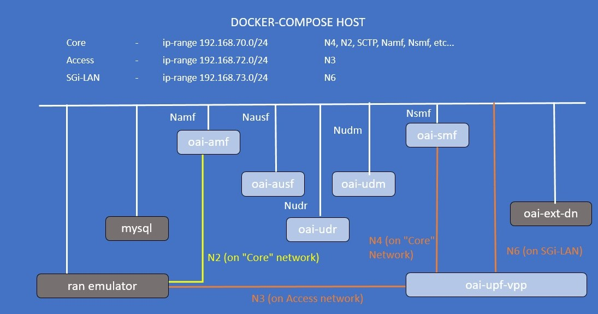

<table style="border-collapse: collapse; border: none;">
  <tr style="border-collapse: collapse; border: none;">
    <td style="border-collapse: collapse; border: none;">
      <a href="http://www.openairinterface.org/">
         
         </img>
      </a>
    </td>
    <td style="border-collapse: collapse; border: none; vertical-align: center;">
      <b><font size = "5">OpenAirInterface 5G Core Network Deployment with eBPF-UPF using docker-compose</font></b>
    </td>
  </tr>
</table>

**TODO: change picture.**



**Reading time: ~ 30mins**

**Tutorial replication time: ~ 1h30mins**

Note: In case readers are interested in deploying debuggers/developers core network environment with more logs, please follow [this tutorial](./DEBUG_5G_CORE.md)

**TABLE OF CONTENTS**

1.  Pre-requisites
2.  [Building Container Images](./BUILD_IMAGES.md) or [Retrieving Container Images](./RETRIEVE_OFFICIAL_IMAGES.md)
3.  Configuring Host Machines
4.  Configuring OAI 5G Core Network Functions
5.  [Deploying OAI 5G Core Network with VPP-UPF](#5-deploying-oai-5g-core-network)
6.  [Stimuli with a RAN emulator](#6-stimuli-with-a-ran-emulator)
7.  [Recover the logs](#7-recover-the-logs)
8.  [Undeploy the Core Network](#8-undeploy-the-core-network)
9.  [Notes](#9-notes)

* In this demo the image tags and commits which were used are listed below, follow [Building images](./BUILD_IMAGES.md) to build images with the tags below.

You can also retrieve the images from `docker-hub`. See [Retrieving images](./RETRIEVE_OFFICIAL_IMAGES.md).

| CNF Name    | Branch Name    | Tag used at time of writing   | Ubuntu 20.04 | RHEL8          |
| ----------- |:-------------- | ----------------------------- | ------------ | ---------------|
| AMF         | `master`       | `v1.6.0`                      | X            | X              |
| AUSF        | `master`       | `v1.6.0`                      | X            | X              |
| NRF         | `master`       | `v1.6.0`                      | X            | X              |
| SMF         | `master`       | `v1.6.0`                      | X            | X              |
| UDR         | `master`       | `v1.6.0`                      | X            | X              |
| UDM         | `master`       | `v1.6.0`                      | X            | X              |
| UPF         | `develop`      | `v1.6.0`                      | X            |                |

**TODO: update this table before release.**

<br/>

In previous tutorials, we were using the `oai-spgwu-tiny` implementation UPF. That implementation has limited throughput capacity and is a pure SW solution.

Moreover in this tutorial, we are going to integrate OAI 5G core with an UPF implementation that uses the eBPF kernel technology.


**About UPF-eBPF**

**TODO: add description here.**

Let's begin !!

* Steps 1 to 4 are similar to previous tutorials such as [minimalist](./DEPLOY_SA5G_MINI_WITH_GNBSIM.md) or [basic](./DEPLOY_SA5G_BASIC_DEPLOYMENT.md) deployments. Please follow these steps to deploy OAI 5G core network components.

## 1. Pre-requisites

Create a folder where you can store all the result files of the tutorial and later compare them with our provided result files, we recommend creating exactly the same folder to not break the flow of commands afterwards.

<!---
For CI purposes please ignore this line
``` shell
docker-compose-host $: rm -rf /tmp/oai/upf-ebpf-gnbsim
```
-->

``` shell
docker-compose-host $: mkdir -p /tmp/oai/upf-ebpf-gnbsim
docker-compose-host $: chmod 777 /tmp/oai/upf-ebpf-gnbsim
```

## 5. Deploying OAI 5g Core Network

* We will use the same wrapper script for docker-compose that was used for previous tutorials to set up 5gcn with `UPF-eBPF`. Use the --help option to check how to use this wrapper script.

**Note: - To use vpp-upf on bare metal, follow [these instructions.](https://gitlab.eurecom.fr/oai/cn5g/oai-cn5g-upf-vpp/-/blob/develop/docs/INSTALL_ON_HOST.md)**

All the following commands shall be executed from the `oai-cn5g-fed/docker-compose` folder.

``` console
oai-cn5g-fed/docker-compose$ $ python3 ./core-network.py --help
OAI 5G CORE NETWORK DEPLOY

optional arguments:
  -h, --help            show this help message and exit
  --type {start-mini,start-basic,start-basic-vpp,start-basic-ebpf,stop-mini,stop-basic,stop-basic-vpp,stop-basic-ebpf}
                        Functional type of 5g core network
  --scenario {1,2}, -s {1,2}
                        Scenario with NRF ("1") and without NRF ("2")
  --capture CAPTURE, -c CAPTURE
                        Add an automatic PCAP capture on docker networks to CAPTURE file

example:
        python3 core-network.py --type start-mini
        python3 core-network.py --type start-basic
        python3 core-network.py --type start-basic-vpp
        python3 core-network.py --type start-basic-ebpf
        python3 core-network.py --type stop-mini
        python3 core-network.py --type start-mini --scenario 2
        python3 core-network.py --type start-basic --scenario 2
```

Currently in this tutorial format, we support a `basic` deployment with the `UPF-eBPF`: `basic-ebpf`,

In that deployment configuration, you can deploy with `NRF` only (ie scenario `1`).

As a first-timer, we recommend that you first deploy without any PCAP capture. We also recommend no capture if you plan to run your CN5G deployment for a long time.

``` console
docker-compose-host $: python3 ./core-network.py --type start-basic-ebpf --scenario 1
```

For CI purposes, we are deploying with an automated PCAP capture on the docker networks.

**REMEMBER: if you are planning to run your CN5G deployment for a long time, the PCAP file can become huge!**

``` shell
docker-compose-host $: python3 ./core-network.py --type start-basic-ebpf --scenario 1 --capture /tmp/oai/upf-ebpf-gnbsim/upf-ebpf-gnbsim.pcap
[2023-07-21 13:21:51,627] root:DEBUG:  Starting 5gcn components... Please wait....
[2023-07-21 13:21:52,066] root:DEBUG: docker-compose -f docker-compose-basic-nrf-ebpf.yaml up -d mysql
Creating network "demo-oai-public-net" with driver "bridge"
Creating network "demo-oai-n3-net" with driver "bridge"
Creating network "demo-oai-n6-net" with driver "bridge"
Creating mysql ...
Creating mysql ... done

[2023-07-21 13:21:53,267] root:DEBUG: nohup sudo tshark -i demo-oai -i demo-n3 -f "(not host 192.168.72.135 and not arp and not port 53 and not port 2152) or (host 192.168.72.135 and icmp)" -w /tmp/oai/upf-ebpf-gnbsim/upf-ebpf-gnbsim.pcap > /dev/null 2>&1 &
[2023-07-21 13:22:13,285] root:DEBUG: docker-compose -f docker-compose-basic-nrf-ebpf.yaml up -d
mysql is up-to-date
Creating oai-nrf ...
Creating oai-ext-dn ...
Creating oai-ext-dn ... done
Creating oai-nrf    ... done
Creating oai-udr    ...
Creating oai-udr    ... done
Creating oai-udm    ...
Creating oai-udm    ... done
Creating oai-ausf   ...
Creating oai-ausf   ... done
Creating oai-amf    ...
Creating oai-amf    ... done
Creating oai-smf    ...
Creating oai-smf    ... done
Creating oai-upf    ...
Creating oai-upf    ... done

[2023-07-21 13:22:17,388] root:DEBUG:  OAI 5G Core network started, checking the health status of the containers... takes few secs....
[2023-07-21 13:22:17,389] root:DEBUG: docker-compose -f docker-compose-basic-nrf-ebpf.yaml ps -a
[2023-07-21 13:22:30,227] root:DEBUG:  All components are healthy, please see below for more details....
Name                 Command                  State                       Ports
---------------------------------------------------------------------------------------------------
mysql        docker-entrypoint.sh mysqld      Up (healthy)   3306/tcp, 33060/tcp
oai-amf      /openair-amf/bin/oai_amf - ...   Up (healthy)   38412/sctp, 80/tcp, 8080/tcp, 9090/tcp
oai-ausf     /openair-ausf/bin/oai_ausf ...   Up (healthy)   80/tcp, 8080/tcp
oai-ext-dn   /bin/bash -c  ip route add ...   Up (healthy)
oai-nrf      /openair-nrf/bin/oai_nrf - ...   Up (healthy)   80/tcp, 8080/tcp, 9090/tcp
oai-smf      /openair-smf/bin/oai_smf - ...   Up (healthy)   80/tcp, 8080/tcp, 8805/udp
oai-udm      /openair-udm/bin/oai_udm - ...   Up (healthy)   80/tcp, 8080/tcp
oai-udr      /openair-udr/bin/oai_udr - ...   Up (healthy)   80/tcp, 8080/tcp
oai-upf      python3 /openair-upf/bin/e ...   Up (healthy)   2152/udp, 8080/tcp, 8805/udp
[2023-07-21 13:22:40,260] root:DEBUG:  Checking if the containers are configured....
[2023-07-21 13:22:40,260] root:DEBUG:  Checking if AMF, SMF and UPF registered with nrf core network....
[2023-07-21 13:22:40,260] root:DEBUG: curl -s -X GET --http2-prior-knowledge http://192.168.70.130:8080/nnrf-nfm/v1/nf-instances?nf-type="AMF" | grep -o "192.168.70.132"
192.168.70.132
[2023-07-21 13:22:40,277] root:DEBUG: curl -s -X GET --http2-prior-knowledge http://192.168.70.130:8080/nnrf-nfm/v1/nf-instances?nf-type="SMF" | grep -o "192.168.70.133"
192.168.70.133
[2023-07-21 13:22:40,293] root:DEBUG: curl -s -X GET --http2-prior-knowledge http://192.168.70.130:8080/nnrf-nfm/v1/nf-instances?nf-type="UPF" | grep -o "192.168.70.134"
192.168.70.134
[2023-07-21 13:22:40,309] root:DEBUG:  Checking if AUSF, UDM and UDR registered with nrf core network....
[2023-07-21 13:22:40,309] root:DEBUG: curl -s -X GET --http2-prior-knowledge http://192.168.70.130:8080/nnrf-nfm/v1/nf-instances?nf-type="AUSF" | grep -o "192.168.70.138"
192.168.70.138
[2023-07-21 13:22:40,324] root:DEBUG: curl -s -X GET --http2-prior-knowledge http://192.168.70.130:8080/nnrf-nfm/v1/nf-instances?nf-type="UDM" | grep -o "192.168.70.137"
192.168.70.137
[2023-07-21 13:22:40,337] root:DEBUG: curl -s -X GET --http2-prior-knowledge http://192.168.70.130:8080/nnrf-nfm/v1/nf-instances?nf-type="UDR" | grep -o "192.168.70.136"
192.168.70.136
[2023-07-21 13:22:40,349] root:DEBUG:  AMF, SMF and UPF are registered to NRF....
[2023-07-21 13:22:40,350] root:DEBUG:  Checking if SMF is able to connect with UPF....
[2023-07-21 13:22:40,417] root:DEBUG:  UPF is receiving heartbeats from SMF....
[2023-07-21 13:22:40,418] root:DEBUG:  OAI 5G Core network is configured and healthy....
```

Here I have deployed with `NRF`:

* The script validates that `AMF`, `SMF`, `UPF`, `AUSF`, `UDM` and `UDR` did register to `NRF`
* The script also validates that SMF associates over `N4` with UPF.

You can also see this with the container logs:

1. UPF registration to NRF
``` console
$ docker logs oai-nrf
[2023-07-21 13:22:14.655] [nrf_app] [start] Options parsed
[2023-07-21 13:22:14.655] [config ] [info] Reading NF configuration from /openair-nrf/etc/config.yaml
[2023-07-21 13:22:14.665] [config ] [debug] Unknown NF amf in configuration. Ignored
[2023-07-21 13:22:14.665] [config ] [debug] Unknown NF smf in configuration. Ignored
[2023-07-21 13:22:14.665] [config ] [debug] Unknown NF udm in configuration. Ignored
[2023-07-21 13:22:14.665] [config ] [debug] Unknown NF udr in configuration. Ignored
[2023-07-21 13:22:14.665] [config ] [debug] Unknown NF ausf in configuration. Ignored
[2023-07-21 13:22:14.666] [config ] [debug] Validating configuration of Log Level
[2023-07-21 13:22:14.666] [config ] [debug] Validating configuration of Register NF
[2023-07-21 13:22:14.666] [config ] [debug] Validating configuration of HTTP Version
[2023-07-21 13:22:14.666] [config ] [debug] Validating configuration of nrf
[2023-07-21 13:22:14.667] [config ] [info] ==== OPENAIRINTERFACE nrf vBranch: HEAD Abrev. Hash: 63b0579 Date: Tue Jul 18 15:32:04 2023 +0000 ====
[2023-07-21 13:22:14.667] [config ] [info] Basic Configuration:
[2023-07-21 13:22:14.667] [config ] [info]   - Log Level..................................: debug
[2023-07-21 13:22:14.667] [config ] [info]   - http_version...............................: 2
[2023-07-21 13:22:14.667] [config ] [info]   nrf:
[2023-07-21 13:22:14.667] [config ] [info]     - Host.....................................: oai-nrf
[2023-07-21 13:22:14.667] [config ] [info]     - SBI
[2023-07-21 13:22:14.667] [config ] [info]       + URL....................................: http://oai-nrf:8080
[2023-07-21 13:22:14.667] [config ] [info]       + API Version............................: v1
[2023-07-21 13:22:14.667] [config ] [info]       + IPv4 Address ..........................: 192.168.70.130
[2023-07-21 13:22:14.667] [config ] [info] Peer NF Configuration:
[2023-07-21 13:22:14.667] [nrf_app] [start] Starting...
[2023-07-21 13:22:14.667] [nrf_app] [debug] Subscribe to NF status registered event
[2023-07-21 13:22:14.667] [nrf_app] [debug] Subscribe to NF status deregistered event
[2023-07-21 13:22:14.667] [nrf_app] [debug] Subscribe to NF status profile changed event
[2023-07-21 13:22:14.667] [nrf_app] [start] Started
[2023-07-21 13:22:14.667] [nrf_app] [info] HTTP2 server started
...
[2023-07-21 13:22:16.740] [nrf_sbi] [info] Got a request to create a new subscription
[2023-07-21 13:22:16.740] [nrf_sbi] [debug] Subscription data null
[2023-07-21 13:22:16.740] [nrf_app] [info] Handle Create a new subscription (HTTP version 2)
[2023-07-21 13:22:16.740] [nrf_app] [debug] Convert a json-type Subscription data a NRF subscription data
[2023-07-21 13:22:16.740] [nrf_app] [debug] Subscription condition type: NfTypeCond, nf_type: UPF
[2023-07-21 13:22:16.740] [nrf_app] [debug] Subscription condition type: NF_TYPE_COND
[2023-07-21 13:22:16.740] [nrf_app] [debug] ReqNotifEvents: NF_REGISTERED
[2023-07-21 13:22:16.740] [nrf_app] [debug] ReqNotifEvents: NF_DEREGISTERED
[2023-07-21 13:22:16.740] [nrf_app] [debug] Validity Time: 20390531T235959
[2023-07-21 13:22:16.740] [nrf_app] [debug] Added a subscription to the DB
[2023-07-21 13:22:16.740] [nrf_app] [debug] Subscription information
[2023-07-21 13:22:16.740] [nrf_app] [debug] 	Sub ID: 1
[2023-07-21 13:22:16.740] [nrf_app] [debug] 	Notification URI: 192.168.70.133:8080/nsmf-nfstatus-notify/v1/subscriptions
[2023-07-21 13:22:16.740] [nrf_app] [debug] 	Subscription condition: Type: NF_TYPE_COND, condition: UPF
[2023-07-21 13:22:16.740] [nrf_app] [debug] 	Notification Events: NF_REGISTERED, NF_DEREGISTERED,
[2023-07-21 13:22:16.740] [nrf_app] [debug] 	Validity time: 20390531T235959
[2023-07-21 13:22:16.750] [nrf_sbi] [info] Got a request to register an NF instance/Update an NF instance, Instance ID: fdbf3711-f9ad-4e6d-b825-38ef8f8ba4ab
[2023-07-21 13:22:16.750] [nrf_app] [info] Handle Register NF Instance/Update NF Instance (HTTP version 2)
[2023-07-21 13:22:16.750] [nrf_app] [debug] NF Profile with ID fdbf3711-f9ad-4e6d-b825-38ef8f8ba4ab, NF type SMF
[2023-07-21 13:22:16.750] [nrf_app] [debug] Convert a json-type profile to a NF profile (profile ID: fdbf3711-f9ad-4e6d-b825-38ef8f8ba4ab)
[2023-07-21 13:22:16.750] [nrf_app] [debug] 	Instance name: OAI-SMF
[2023-07-21 13:22:16.750] [nrf_app] [debug] Set NF status to REGISTERED
[2023-07-21 13:22:16.750] [nrf_app] [debug] getCustomInfo -> null
[2023-07-21 13:22:16.750] [nrf_app] [debug] 	Status: REGISTERED
[2023-07-21 13:22:16.750] [nrf_app] [debug] 	Heartbeat timer: 50
[2023-07-21 13:22:16.750] [nrf_app] [debug] 	Priority: 1
[2023-07-21 13:22:16.750] [nrf_app] [debug] 	Capacity: 100
[2023-07-21 13:22:16.750] [nrf_app] [debug] 	SNSSAI (SD, SST): 1, 16777215
[2023-07-21 13:22:16.750] [nrf_app] [debug] 	SNSSAI (SD, SST): 1, 1
[2023-07-21 13:22:16.750] [nrf_app] [debug] 	SNSSAI (SD, SST): 222, 123
[2023-07-21 13:22:16.750] [nrf_app] [debug] 	IPv4 Addr: 192.168.70.133
[2023-07-21 13:22:16.750] [nrf_app] [debug] 	SMF profile, SMF Info
[2023-07-21 13:22:16.750] [nrf_app] [debug] 		NSSAI SD: 16777215, SST: 1
[2023-07-21 13:22:16.750] [nrf_app] [debug] 		DNN: oai
[2023-07-21 13:22:16.750] [nrf_app] [debug] 		NSSAI SD: 1, SST: 1
[2023-07-21 13:22:16.750] [nrf_app] [debug] 		DNN: oai.ipv4
[2023-07-21 13:22:16.750] [nrf_app] [debug] 		NSSAI SD: 123, SST: 222
[2023-07-21 13:22:16.750] [nrf_app] [debug] 		DNN: default
...
```
2. SMF PFCP association with UPF-VPP
``` console
$ docker logs oai-smf
[2023-07-21 11:22:16.732] [config ] [info] ==== OPENAIRINTERFACE smf vBranch: HEAD Abrev. Hash: 0602c5d7 Date: Tue Jul 18 16:34:07 2023 +0000 ====
[2023-07-21 11:22:16.732] [config ] [info] Basic Configuration:
[2023-07-21 11:22:16.732] [config ] [info]   - Log Level..................................: debug
[2023-07-21 11:22:16.732] [config ] [info]   - Register NF................................: Yes
[2023-07-21 11:22:16.732] [config ] [info]   - http_version...............................: 2
[2023-07-21 11:22:16.732] [config ] [info] SMF Config:
[2023-07-21 11:22:16.732] [config ] [info]   - Host.......................................: oai-smf
[2023-07-21 11:22:16.732] [config ] [info]   - SBI
[2023-07-21 11:22:16.732] [config ] [info]     + URL......................................: http://oai-smf:8080
[2023-07-21 11:22:16.732] [config ] [info]     + API Version..............................: v1
[2023-07-21 11:22:16.732] [config ] [info]     + IPv4 Address ............................: 192.168.70.133
[2023-07-21 11:22:16.732] [config ] [info]   - N4
[2023-07-21 11:22:16.732] [config ] [info]     + Port.....................................: 8805
[2023-07-21 11:22:16.732] [config ] [info]     + IPv4 Address ............................: 192.168.70.133
[2023-07-21 11:22:16.732] [config ] [info]     + MTU......................................: 1500
[2023-07-21 11:22:16.732] [config ] [info]     + Interface name: .........................: eth0
[2023-07-21 11:22:16.732] [config ] [info]   Supported Features:
[2023-07-21 11:22:16.732] [config ] [info]     + Use Local Subscription Info..............: Yes
[2023-07-21 11:22:16.732] [config ] [info]     + Use Local PCC Rules......................: Yes
[2023-07-21 11:22:16.732] [config ] [info]   - UE MTU.....................................: 1500
[2023-07-21 11:22:16.732] [config ] [info]   - P-CSCF IPv4................................: 127.0.0.1
[2023-07-21 11:22:16.732] [config ] [info]   - P-CSCF IPv6................................: fe80::7915:f408:1787:db8b
[2023-07-21 11:22:16.732] [config ] [info]   UPF List:
[2023-07-21 11:22:16.732] [config ] [info]     - oai-upf
[2023-07-21 11:22:16.732] [config ] [info]       + Host...................................: oai-upf
[2023-07-21 11:22:16.732] [config ] [info]       + Port...................................: 8805
[2023-07-21 11:22:16.732] [config ] [info]       + Enable Usage Reporting.................: No
[2023-07-21 11:22:16.732] [config ] [info]       + Enable DL PDR In Session Establishment.: No
[2023-07-21 11:22:16.732] [config ] [info]       + Interface Configuration:
[2023-07-21 11:22:16.732] [config ] [info]         - NWI N3...............................: access.oai.org
[2023-07-21 11:22:16.732] [config ] [info]         - NWI N6...............................: core.oai.org
...
[2023-07-21 11:22:16.732] [itti   ] [start] Starting...
...
[2023-07-21 11:22:37.439] [smf_n4 ] [info] TIME-OUT event timer id 9
[2023-07-21 11:22:37.439] [smf_n4 ] [info] PFCP HEARTBEAT PROCEDURE hash 16073795300291001156 starting
[2023-07-21 11:22:37.439] [smf_n4 ] [info] handle_receive(16 bytes)
[2023-07-21 11:22:37.439] [smf_n4 ] [debug] handle_receive_pfcp_msg msg type 2 length 12
[2023-07-21 11:22:42.439] [smf_n4 ] [info] TIME-OUT event timer id 13
...
```

## 6. Simulate with a RAN emulator

### 6.1. Test with Gnbsim

In this Section we will use Gnbsim to test our deployemt. Make sure you already have built [Gnbsim docker image](./DEPLOY_SA5G_MINI_WITH_GNBSIM.md#6-getting-a-gnbsim-docker-image)<br/>
Launch gnbsim instance:

``` shell
docker-compose-host $: docker-compose -f docker-compose-gnbsim-ebpf.yaml up -d gnbsim-ebpf
Found orphan containers (mysql, oai-udm, oai-upf, oai-smf, oai-ausf, oai-ext-dn, oai-amf, oai-udr, oai-nrf) for this project. If you removed or renamed this service in your compose file, you can run this command with the --remove-orphans flag to clean it up.
Creating gnbsim-ebpf ...
Creating gnbsim-ebpf ... done
```

<!---
For CI purposes please ignore this line
``` shell
docker-compose-host $: ../ci-scripts/checkContainerStatus.py --container_name gnbsim-ebpf --timeout 30
[2023-07-21 13:22:55,850]    DEBUG: Healthy in 10.20 seconds
```
-->

Make sure Gnbsim service is healthy:
``` shell
docker-compose-host $: docker-compose -f docker-compose-gnbsim-ebpf.yaml ps -a
   Name                 Command                  State       Ports
------------------------------------------------------------------
gnbsim-ebpf   /gnbsim/bin/entrypoint.sh  ...   Up (healthy)
docker-compose-host $: docker logs gnbsim-ebpf | tail -10
[gnbsim]2023/07/21 11:22:50.647779 example.go:241: GTP-U interface name: eth1
[gnbsim]2023/07/21 11:22:50.647805 example.go:242: GTP-U local addr: 192.168.71.141
[gnbsim]2023/07/21 11:22:50.647820 example.go:243: GTP-U peer addr : 192.168.71.134
[gnbsim]2023/07/21 11:22:51.648907 example.go:328: GTP-U Peer TEID: 1
[gnbsim]2023/07/21 11:22:51.648933 example.go:329: GTP-U Local TEID: 2596996162
[gnbsim]2023/07/21 11:22:51.648944 example.go:330: QoS Flow ID: 9
[gnbsim]2023/07/21 11:22:51.648956 example.go:332: UE address: 12.1.1.2
[gnbsim]2023/07/21 11:22:52.649554 example.go:194: Deregister after : 3600 Sec
```

## 7. Recover the logs

<!---
For CI purposes please ignore these lines
``` shell
docker-compose-host $: docker-compose -f docker-compose-gnbsim-ebpf.yaml stop -t 2
Stopping gnbsim-ebpf ... done
docker-compose-host $: docker-compose -f docker-compose-basic-nrf-ebpf.yaml stop -t 2
Stopping oai-ext-dn ... done
Stopping oai-smf    ... done
Stopping oai-amf    ... done
Stopping oai-ausf   ... done
Stopping oai-udm    ... done
Stopping oai-udr    ... done
Stopping oai-nrf    ... done
Stopping mysql      ... done
```
-->

``` shell
docker-compose-host $: docker logs oai-amf > /tmp/oai/upf-ebpf-gnbsim/amf.log 2>&1
docker-compose-host $: docker logs oai-smf > /tmp/oai/upf-ebpf-gnbsim/smf.log 2>&1
docker-compose-host $: docker logs oai-nrf > /tmp/oai/upf-ebpf-gnbsim/nrf.log 2>&1
docker-compose-host $: docker logs oai-upf > /tmp/oai/upf-ebpf-gnbsim/upf.log 2>&1
docker-compose-host $: docker logs oai-udr > /tmp/oai/upf-ebpf-gnbsim/udr.log 2>&1
docker-compose-host $: docker logs oai-udm > /tmp/oai/upf-ebpf-gnbsim/udm.log 2>&1
docker-compose-host $: docker logs oai-ausf > /tmp/oai/upf-ebpf-gnbsim/ausf.log 2>&1
docker-compose-host $: docker logs gnbsim-ebpf > /tmp/oai/upf-ebpf-gnbsim/gnbsim-ebpf.log 2>&1
```

## 8. Undeploy the Core Network

### 8.1. Undeploy the RAN emulator

``` shell
docker-compose-host $: docker-compose -f docker-compose-gnbsim-ebpf.yaml down -t 0
Found orphan containers (oai-smf, oai-ausf, oai-nrf, oai-udr, oai-ext-dn, mysql, oai-amf, oai-upf, oai-udm) for this project. If you removed or renamed this service in your compose file, you can run this command with the --remove-orphans flag to clean it up.
Removing gnbsim-ebpf ... done
Network demo-oai-public-net is external, skipping
Network demo-oai-n3-net is external, skipping
```

### 8.2. Undeploy the Core Network

``` shell
docker-compose-host $: python3 ./core-network.py --type stop-basic-ebpf --scenario 1
[2023-07-21 13:23:19,260] root:DEBUG:  UnDeploying OAI 5G core components....
[2023-07-21 13:23:19,260] root:DEBUG: docker-compose -f docker-compose-basic-nrf-ebpf.yaml down -t 0
Removing oai-ausf   ... done
Removing oai-nrf    ... done
Removing oai-ext-dn ... done
Removing oai-udr    ... done
Removing oai-amf    ... done
Removing oai-upf    ... done
Removing oai-smf    ... done
Removing mysql      ... done
Removing oai-udm    ... done
Removing network demo-oai-public-net
Removing network demo-oai-n3-net
Removing network demo-oai-n6-net

[2023-07-21 13:23:20,429] root:DEBUG:  OAI 5G core components are UnDeployed....
```

If you replicate then your log files and pcap file will be present in `/tmp/oai/upf-ebpf-gnbsim/`.

## 9. Notes

